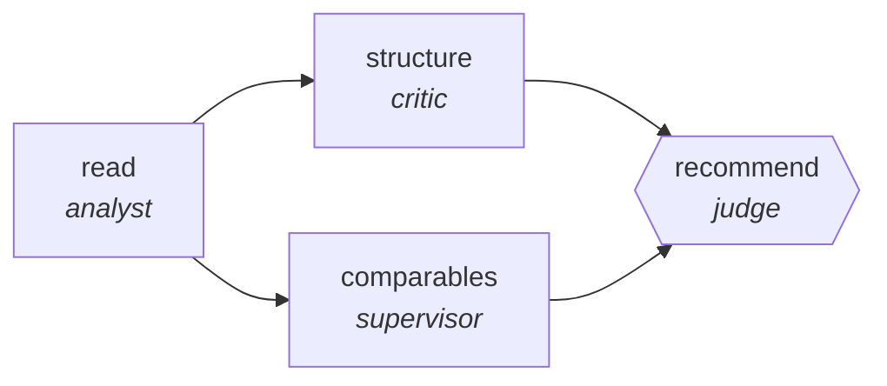

<!-- generated by scripts/gen_traces.py — edit graph.yaml / evals/<name>/cases.yaml, then `uv run python scripts/gen_traces.py` -->
# 🔍 Trace gallery · `screenplay-coverage`

> Produce studio-standard coverage: synopsis, structural analysis, comparables, and a defended recommendation.

1 golden case(s), 1/1 passing (`mock` runner, provisional).

## The graph

## Cases

### `happy-path` — ✅ passed

**Route** (6 step(s)): `read` → `structure` → `comparables.partition` → `comparables.map` → `comparables.reduce` → `recommend`

| # | Node | Output |
|---|---|---|
| 1 | `read` | `synopsis=[], beats=[]` |
| 2 | `structure` | `structure_notes=[]` |
| 3 | `comparables.partition` | `complexity='simple', risk='low', revision_requested=False, rejected=False, verify_failed=False, below_target=False, attempts=1` |
| 4 | `comparables.map` | *(no fixture — empty output)* |
| 5 | `comparables.reduce` | `comps=[{'title': 'A'}, {'title': 'B'}]` |
| 6 | `recommend` | `recommendation='consider', rationale='rationale-value', output={'recommendation': 'consider', 'comps': [{'title': 'A'}, {'title': 'B'}]}` |

**Verification checked:**

- ✅ `output.recommendation in ['pass','consider','recommend']`
- ✅ `len(output.comps) >= 2`

---
*Regenerate: `uv run python scripts/gen_traces.py` · [Trace gallery index](README.md) · [Graph card](../../graphs/creative-production/screenplay-coverage/CARD.md)*
