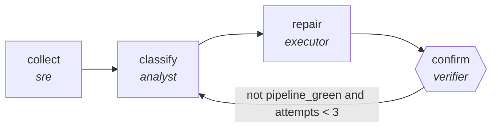

<!-- generated by scripts/gen_traces.py — edit graph.yaml / cases.yaml, then `uv run python scripts/gen_traces.py` -->
# 🔍 Trace gallery · `self-healing-ci`

> Diagnose a red pipeline, attempt a bounded repair, and accumulate what did not work across runs.

1 golden case(s), 1/1 passing (`mock` runner, provisional).

## The graph

## Cases

### `happy-path` — ✅ passed

**Route** (4 step(s)): `collect` → `classify` → `repair` → `confirm`

| # | Node | Output |
|---|---|---|
| 1 | `collect` | `failures='failures-value'` |
| 2 | `classify` | `cause='cause-value', known='known-value'` |
| 3 | `repair` | `repair_applied='repair_applied-value'` |
| 4 | `confirm` | `pipeline_green=True, lessons=[{'tried': 'clear cache', 'ruled_out': 'stale artifacts'}], output={'pipeline_green': True, 'escalated': False, 'lessons': [{'tried': 'clear cache', 'ruled_out': 'stale artifacts'}]}, escalated=False` |

**Verification checked:**

- ⏭️ `pytest -q` — command checks are skipped by the mock runner (run with `--live` against a real environment to exercise them)
- ✅ `len(output.lessons) >= 1 and output.attempts <= 3`

---
*Regenerate: `uv run python scripts/gen_traces.py` · [Trace gallery index](README.md) · [Graph card](../../graphs/devops-sre/self-healing-ci/CARD.md)*
