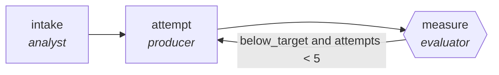

<!-- generated by scripts/gen_traces.py — edit graph.yaml / evals/<name>/cases.yaml, then `uv run python scripts/gen_traces.py` -->
# 🔍 Trace gallery · `seo-optimization-loop`

> Rewrite for target queries, re-score, iterate to threshold.

2 golden case(s), 2/2 passing (`mock` runner, provisional).

## The graph

## Cases

### `meets-target-first-try` — ✅ passed

**Route** (3 step(s)): `intake` → `attempt` → `measure`

| # | Node | Output |
|---|---|---|
| 1 | `intake` | `summary='intake complete'` |
| 2 | `attempt` | `output={'seo_score': 82, 'threshold': 75, 'stuffing_flags': []}` |
| 3 | `measure` | `below_target=False, attempts=1` |

**Verification checked:**

- ✅ `output.seo_score >= output.threshold and not output.stuffing_flags`

### `retry-then-meets-target` — ✅ passed

**Route** (5 step(s)): `intake` → `attempt` → `measure` → `attempt` → `measure`

| # | Node | Output |
|---|---|---|
| 1 | `intake` | `summary='intake complete'` |
| 2 | `attempt` | `output={'seo_score': 60, 'threshold': 75, 'stuffing_flags': []}` |
| 3 | `measure` | `below_target=True, attempts=1` |
| 4 | `attempt` | `output={'seo_score': 82, 'threshold': 75, 'stuffing_flags': []}` |
| 5 | `measure` | `below_target=False, attempts=2` |

**Verification checked:**

- ✅ `output.seo_score >= output.threshold and not output.stuffing_flags`

---
*Regenerate: `uv run python scripts/gen_traces.py` · [Trace gallery index](README.md) · [Graph card](../../graphs/content-marketing/seo-optimization-loop/CARD.md)*
