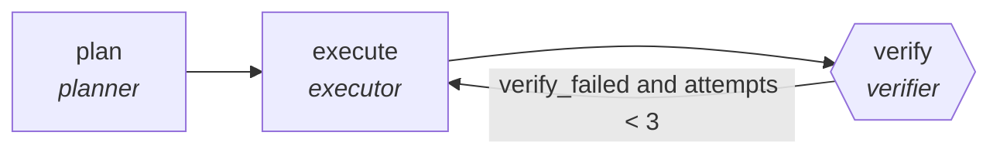

<!-- generated by scripts/gen_traces.py — edit graph.yaml / cases.yaml, then `uv run python scripts/gen_traces.py` -->
# 🔍 Trace gallery · `soc-alert-investigation`

> Investigate an alert with hypothesis-driven queries.

2 golden case(s), 2/2 passing (`mock` runner, provisional).

## The graph

## Cases

### `first-attempt-verified` — ✅ passed

**Route** (3 step(s)): `plan` → `execute` → `verify`

| # | Node | Output |
|---|---|---|
| 1 | `plan` | `steps=['decompose goal']` |
| 2 | `execute` | `step_result={'step': 1, 'status': 'done'}` |
| 3 | `verify` | `verify_failed=False, attempts=1, output={'conclusion': 'confirmed brute-force login attempt', 'query_results': [{'query': 'failed logins by ip', 'result': '42 attempts from 1.2.3.4'}]}` |

**Verification checked:**

- ✅ `len(output.query_results) > 0 and output.conclusion`

### `retry-then-verified` — ✅ passed

**Route** (5 step(s)): `plan` → `execute` → `verify` → `execute` → `verify`

| # | Node | Output |
|---|---|---|
| 1 | `plan` | `steps=['decompose goal']` |
| 2 | `execute` | `step_result={'step': 1, 'status': 'done'}` |
| 3 | `verify` | `verify_failed=True, attempts=1` |
| 4 | `execute` | `step_result={'step': 1, 'status': 'done'}` |
| 5 | `verify` | `verify_failed=False, attempts=2, output={'conclusion': 'confirmed brute-force login attempt', 'query_results': [{'query': 'failed logins by ip', 'result': '42 attempts from 1.2.3.4'}]}` |

**Verification checked:**

- ✅ `len(output.query_results) > 0 and output.conclusion`

---
*Regenerate: `uv run python scripts/gen_traces.py` · [Trace gallery index](README.md) · [Graph card](../../graphs/security/soc-alert-investigation/CARD.md)*
