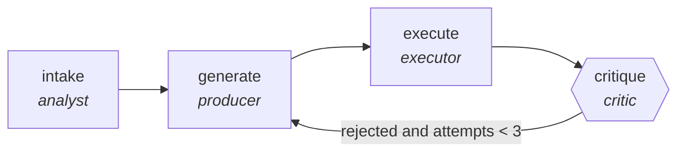

<!-- generated by scripts/gen_traces.py — edit graph.yaml / cases.yaml, then `uv run python scripts/gen_traces.py` -->
# 🔍 Trace gallery · `sql-generation-verified`

> Generate SQL, critic checks schema validity and row sanity.

2 golden case(s), 2/2 passing (`mock` runner, provisional).

## The graph

## Cases

### `generated-and-approved` — ✅ passed

**Route** (4 step(s)): `intake` → `generate` → `execute` → `critique`

| # | Node | Output |
|---|---|---|
| 1 | `intake` | `summary='intake complete'` |
| 2 | `generate` | `draft='v1'` |
| 3 | `execute` | `row_count=12, exit_code=0` |
| 4 | `critique` | `rejected=False, attempts=1, output={'query_executes': True, 'row_count_sane': True, 'exit_code': 0, 'row_count': 12}, exit_code=0, row_count=12` |

**Verification checked:**

- ✅ `output.exit_code == 0`
- ✅ `output.row_count > 0`
- ⏭️ `psql -v ON_ERROR_STOP=1 -f {query_path}` — command checks are skipped by the mock runner (run with `--live` against a real environment to exercise them)

### `revised-after-rejection` — ✅ passed

**Route** (7 step(s)): `intake` → `generate` → `execute` → `critique` → `generate` → `execute` → `critique`

| # | Node | Output |
|---|---|---|
| 1 | `intake` | `summary='intake complete'` |
| 2 | `generate` | `draft='v1'` |
| 3 | `execute` | `row_count=12, exit_code=0` |
| 4 | `critique` | `rejected=True, attempts=1, exit_code=0, row_count=12, output={'exit_code': 0, 'row_count': 12}` |
| 5 | `generate` | `draft='v2'` |
| 6 | `execute` | `row_count=12, exit_code=0` |
| 7 | `critique` | `rejected=False, attempts=2, output={'query_executes': True, 'row_count_sane': True, 'exit_code': 0, 'row_count': 12}, exit_code=0, row_count=12` |

**Verification checked:**

- ✅ `output.exit_code == 0`
- ✅ `output.row_count > 0`
- ⏭️ `psql -v ON_ERROR_STOP=1 -f {query_path}` — command checks are skipped by the mock runner (run with `--live` against a real environment to exercise them)

---
*Regenerate: `uv run python scripts/gen_traces.py` · [Trace gallery index](README.md) · [Graph card](../../graphs/data-analytics/sql-generation-verified/CARD.md)*
