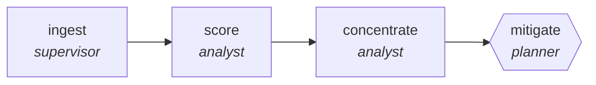

<!-- generated by scripts/gen_traces.py — edit graph.yaml / cases.yaml, then `uv run python scripts/gen_traces.py` -->
# 🔍 Trace gallery · `supplier-risk-monitor`

> Score supplier concentration, financial and geographic risk, then plan mitigation for anything above appetite.

1 golden case(s), 1/1 passing (`mock` runner, provisional).

## The graph

## Cases

### `happy-path` — ✅ passed

**Route** (6 step(s)): `ingest.partition` → `ingest.map` → `ingest.reduce` → `score` → `concentrate` → `mitigate`

| # | Node | Output |
|---|---|---|
| 1 | `ingest.partition` | `shard_count=1` |
| 2 | `ingest.map` | *(no fixture — empty output)* |
| 3 | `ingest.reduce` | `supplier_signals=[], output={'findings': [{'title': 'competitor launched feature X', 'source_url': 'https://example.com/blog', 'source_date': '2026-07-01'}]}` |
| 4 | `score` | `risk_scores=[]` |
| 5 | `concentrate` | `concentration='concentration-value'` |
| 6 | `mitigate` | `mitigations=[], output={'above_appetite': 4, 'mitigations_planned': 4, 'single_source_flagged': True}` |

**Verification checked:**

- ✅ `output.above_appetite == output.mitigations_planned`
- ✅ `output.single_source_flagged == true`

---
*Regenerate: `uv run python scripts/gen_traces.py` · [Trace gallery index](README.md) · [Graph card](../../graphs/logistics-retail/supplier-risk-monitor/CARD.md)*
