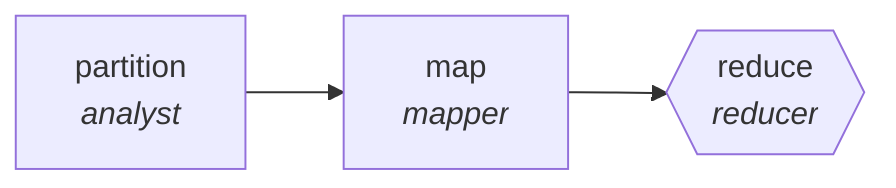

<!-- generated by scripts/gen_traces.py — edit graph.yaml / evals/<name>/cases.yaml, then `uv run python scripts/gen_traces.py` -->
# 🔍 Trace gallery · `threat-intel-digest`

> Summarize feeds into an actionable daily brief.

2 golden case(s), 2/2 passing (`mock` runner, provisional).

## The graph

## Cases

### `single-item` — ✅ passed

**Route** (3 step(s)): `partition` → `map` → `reduce`

| # | Node | Output |
|---|---|---|
| 1 | `partition` | `shard_count=1, shards=[{'i': 1}, {'i': 2}, {'i': 3}]` |
| 2 | `map` | *(no fixture — empty output)* |
| 3 | `reduce` | `output={'entries': [{'advisory_url': 'https://vendor.example/advisory/1', 'cve_ids': ['CVE-2026-1']}]}` |

**Verification checked:**

- ✅ `all(i.advisory_url and i.cve_ids for i in output.entries)`

### `multi-item` — ✅ passed

**Route** (3 step(s)): `partition` → `map` → `reduce`

| # | Node | Output |
|---|---|---|
| 1 | `partition` | `shard_count=2, shards=[{'i': 1}, {'i': 2}, {'i': 3}]` |
| 2 | `map` | *(no fixture — empty output)* |
| 3 | `reduce` | `output={'entries': [{'advisory_url': 'https://vendor.example/advisory/1', 'cve_ids': ['CVE-2026-1']}, {'advisory_url': 'https://vendor.example/advisory/2', 'cve_ids': ['CVE-2026-2', 'CVE-2026-3']}]}` |

**Verification checked:**

- ✅ `all(i.advisory_url and i.cve_ids for i in output.entries)`

---
*Regenerate: `uv run python scripts/gen_traces.py` · [Trace gallery index](README.md) · [Graph card](../../graphs/security/threat-intel-digest/CARD.md)*
