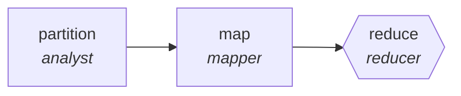

<!-- generated by scripts/gen_traces.py — edit graph.yaml / evals/<name>/cases.yaml, then `uv run python scripts/gen_traces.py` -->
# 🔍 Trace gallery · `ux-research-synthesis`

> Code interview transcripts, reduce to themed insights.

2 golden case(s), 2/2 passing (`mock` runner, provisional).

## The graph

## Cases

### `single-item` — ✅ passed

**Route** (3 step(s)): `partition` → `map` → `reduce`

| # | Node | Output |
|---|---|---|
| 1 | `partition` | `shard_count=1` |
| 2 | `map` | *(no fixture — empty output)* |
| 3 | `reduce` | `output={'insights': [{'theme': 'onboarding confusion', 'participant_ids': ['P1', 'P2']}]}` |

**Verification checked:**

- ✅ `all(i.participant_ids[1:] for i in output.insights)`

### `multi-item` — ✅ passed

**Route** (3 step(s)): `partition` → `map` → `reduce`

| # | Node | Output |
|---|---|---|
| 1 | `partition` | `shard_count=2` |
| 2 | `map` | *(no fixture — empty output)* |
| 3 | `reduce` | `output={'insights': [{'theme': 'onboarding confusion', 'participant_ids': ['P1', 'P2', 'P3']}, {'theme': 'pricing page', 'participant_ids': ['P4', 'P5']}]}` |

**Verification checked:**

- ✅ `all(i.participant_ids[1:] for i in output.insights)`

---
*Regenerate: `uv run python scripts/gen_traces.py` · [Trace gallery index](README.md) · [Graph card](../../graphs/creative-production/ux-research-synthesis/CARD.md)*
