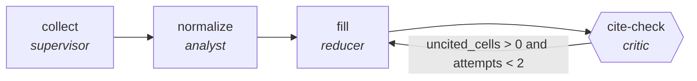

<!-- generated by scripts/gen_traces.py — edit graph.yaml / evals/<name>/cases.yaml, then `uv run python scripts/gen_traces.py` -->
# 🔍 Trace gallery · `vendor-comparison-matrix`

> Build a like-for-like vendor matrix where every cell cites the source document it came from.

1 golden case(s), 1/1 passing (`mock` runner, provisional).

## The graph

## Cases

### `happy-path` — ✅ passed

**Route** (6 step(s)): `collect.partition` → `collect.map` → `collect.reduce` → `normalize` → `fill` → `cite-check`

| # | Node | Output |
|---|---|---|
| 1 | `collect.partition` | `complexity='simple', risk='low', revision_requested=False, rejected=False, verify_failed=False, below_target=False, attempts=1` |
| 2 | `collect.map` | *(no fixture — empty output)* |
| 3 | `collect.reduce` | `vendor_docs=[]` |
| 4 | `normalize` | `criteria_grid=[]` |
| 5 | `fill` | `matrix='matrix-value'` |
| 6 | `cite-check` | `uncited_cells=0, output={'uncited_cells': 0, 'criteria_consistent': True}` |

**Verification checked:**

- ✅ `output.uncited_cells == 0`
- ✅ `output.criteria_consistent == true`

---
*Regenerate: `uv run python scripts/gen_traces.py` · [Trace gallery index](README.md) · [Graph card](../../graphs/business-ops/vendor-comparison-matrix/CARD.md)*
