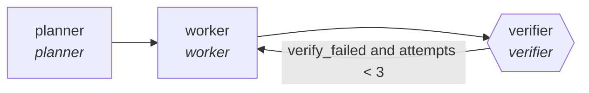

<!-- generated by scripts/gen_traces.py — edit graph.yaml / cases.yaml, then `uv run python scripts/gen_traces.py` -->
# 🔍 Trace gallery · `verifier-swarm`

> Planner fans work out to isolated workers; nothing merges until a verifier command proves the goal is done.

3 golden case(s), 3/3 passing (`mock` runner, provisional).

## The graph

## Cases

### `first-attempt-verified` — ✅ passed

**Route** (3 step(s)): `planner` → `worker` → `verifier`

| # | Node | Output |
|---|---|---|
| 1 | `planner` | `plan=['fix-timeout'], tasks=[{'i': 1}, {'i': 2}, {'i': 3}]` |
| 2 | `worker` | `patched=True` |
| 3 | `verifier` | `verify_failed=False, attempts=1, output={'verified': True, 'escalated': False}, escalated=False` |

**Verification checked:**

- ⏭️ `{verify_command}` — command checks are skipped by the mock runner (run with `--live` against a real environment to exercise them)
- ✅ `output.attempts <= 3`

### `retry-then-verified` — ✅ passed

**Route** (5 step(s)): `planner` → `worker` → `verifier` → `worker` → `verifier`

| # | Node | Output |
|---|---|---|
| 1 | `planner` | `plan=['fix-timeout'], tasks=[{'i': 1}, {'i': 2}, {'i': 3}]` |
| 2 | `worker` | `patched=False` |
| 3 | `verifier` | `verify_failed=True, attempts=1, escalated=False, output={'escalated': False}` |
| 4 | `worker` | `patched=True` |
| 5 | `verifier` | `verify_failed=False, attempts=2, output={'verified': True, 'escalated': False}, escalated=False` |

**Verification checked:**

- ⏭️ `{verify_command}` — command checks are skipped by the mock runner (run with `--live` against a real environment to exercise them)
- ✅ `output.attempts <= 3`

### `three-failures-escalates` — ✅ passed

**Route** (7 step(s)): `planner` → `worker` → `verifier` → `worker` → `verifier` → `worker` → `verifier`

| # | Node | Output |
|---|---|---|
| 1 | `planner` | `plan=['impossible'], tasks=[{'i': 1}, {'i': 2}, {'i': 3}]` |
| 2 | `worker` | *(no fixture — empty output)* |
| 3 | `verifier` | `verify_failed=True, attempts=1, escalated=False, output={'escalated': False}` |
| 4 | `worker` | *(no fixture — empty output)* |
| 5 | `verifier` | `verify_failed=True, attempts=2, escalated=False, output={'escalated': False}` |
| 6 | `worker` | *(no fixture — empty output)* |
| 7 | `verifier` | `verify_failed=True, attempts=3, output={'verified': False, 'escalated': False}, escalated=False` |

**Verification checked:**

- ⏭️ `{verify_command}` — command checks are skipped by the mock runner (run with `--live` against a real environment to exercise them)
- ✅ `output.attempts <= 3`

---
*Regenerate: `uv run python scripts/gen_traces.py` · [Trace gallery index](README.md) · [Graph card](../../graphs/devops-sre/verifier-swarm/CARD.md)*
