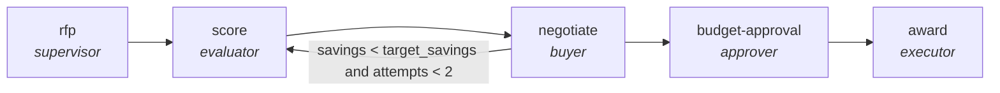

<!-- generated by scripts/gen_cards.py — edit graph.yaml / usecases/catalog.yaml, then `uv run python scripts/gen_cards.py` -->
# 🪪 AGR-123 · `procurement-lifecycle`

> Run an RFP, score vendors, negotiate terms, and gate the award on budget-holder approval.

| Card ID | Domain | Pattern | Nodes | Edges | Verifiers | Routers | Max steps | Risk surface |
|---|---|---|---|---|---|---|---|---|
| `AGR-123` | business-ops | **human-gate** | 5 | 5 | 0 | 0 | 35 | execute |

> 🎯 **Requires a goal** — the requirement to source, with its budget envelope and award deadline. Without one the graph refuses and runs no node.

## The graph



Legend: `[/…/]` router · `{{…}}` verifier · `[…]` worker/agent node.

## What it does

Run an RFP, score vendors, negotiate and gate the award on budget-holder approval.

## Why it should deliver results

A `kind: human` node holds an approval contract that no model may sign — the live runner raises rather than approve its own work. Downstream flow edges stay blocked until the contract evaluates true, which is what makes a graph usable in a regulated domain instead of merely plausible-looking.

- **Exit contract** — no award without three rubric-scored vendors and a budget-holder signature
- **Machine-checked** — `output.scored_vendors >= 3`
- **Machine-checked** — `output.signed_off == true`
- **Bounded** — hard stop after 35 steps; every loop edge is condition-guarded
- **Golden cases** — `uv run agr eval procurement-lifecycle` replays recorded cases through the real edge/assert logic (mock runner proves mechanics; `--live` measures your model)
- **Trace gallery** — [every case's route, node outputs, and checked asserts](../../../docs/traces/procurement-lifecycle.md)

## How to work with it

```bash
uv run agr show procurement-lifecycle       # full definition
uv run agr profile procurement-lifecycle    # deterministic structural facts
uv run agr mermaid procurement-lifecycle    # regenerate the diagram below
uv run agr eval procurement-lifecycle       # run golden cases (add --live for your endpoint)
uv run agr adapt procurement-lifecycle --target langgraph > app.py   # compile to runnable LangGraph
uv run agr optimize procurement-lifecycle   # propose bounded structural improvements (dry-run)
```

Over MCP: `uv run agr mcp` exposes the registry (search / show / profile) to any MCP client.
To evolve it: `uv run agr infuse procurement-lifecycle <node> <ability>` — every mutation is gate-checked and appended to the graph's lineage log.

## Node roster

| Node | Speciality | Kind | Abilities |
|---|---|---|---|
| `rfp` | supervisor | subgraph | — |
| `score` | evaluator | agent | evaluate |
| `negotiate` | buyer | agent | negotiate, analyze |
| `budget-approval` | approver | human | approve |
| `award` | executor | agent | execute_step |

## Edge logic

| From | To | Condition |
|---|---|---|
| `rfp` | `score` | always |
| `score` | `negotiate` | always |
| `negotiate` | `score` | savings < target_savings and attempts < 2 |
| `negotiate` | `budget-approval` | always |
| `budget-approval` | `award` | always |

## Optional use-cases

Adjacent entries from the use-case catalog this card adapts to with small edits:

- **okr-drafting-debate** (business-ops, debate) — Ambition versus feasibility advocates converge on OKRs. *Verify:* each KR is measurable with a data source named.
- **process-documentation-miner** (business-ops, map-reduce) — Mine tickets and chats to document the de facto process. *Verify:* steps corroborated by at least two sources.

---
*Regenerate: `uv run python scripts/gen_cards.py` · Index: [CARDS.md](../../../CARDS.md)*
