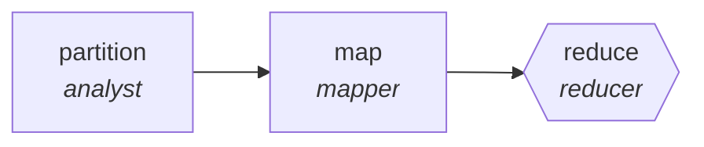

<!-- generated by scripts/gen_cards.py — edit graph.yaml / usecases/catalog.yaml, then `uv run python scripts/gen_cards.py` -->
# 🪪 AGR-042 · `rfp-response-assembler`

> Answer each RFP requirement from a knowledge base, assemble.

| Card ID | Domain | Pattern | Nodes | Edges | Verifiers | Routers | Max steps | Risk surface |
|---|---|---|---|---|---|---|---|---|
| `AGR-042` | business-ops | **map-reduce** | 3 | 2 | 1 | 0 | 20 | write |

## The graph



Legend: `[/…/]` router · `{{…}}` verifier · `[…]` worker/agent node.

## What it does

Answer each RFP requirement from a knowledge base, assemble.

## Why it should deliver results

Work fans out over shards and the reduce step merges with explicit dedupe and conflict rules, so throughput scales with shard count while the output stays a single consistent artifact.

- **Exit contract** — every requirement answered or flagged; page limit met
- **Machine-checked** — `every requirement answered or flagged; page limit met`
- **Bounded** — hard stop after 20 steps; the topology is acyclic
- **Gate-checked** — schema + lint + structural gate run in CI; golden eval cases are the next step for this card (see `evals/` for the format)

## How to work with it

```bash
uv run agr show rfp-response-assembler       # full definition
uv run agr profile rfp-response-assembler    # deterministic structural facts
uv run agr mermaid rfp-response-assembler    # regenerate the diagram below
uv run agr adapt rfp-response-assembler --target langgraph > app.py   # compile to runnable LangGraph
uv run agr optimize rfp-response-assembler   # propose bounded structural improvements (dry-run)
```

Over MCP: `uv run agr mcp` exposes the registry (search / show / profile) to any MCP client.
To evolve it: `uv run agr infuse rfp-response-assembler <node> <ability>` — every mutation is gate-checked and appended to the graph's lineage log.

## Node roster

| Node | Speciality | Kind | Abilities |
|---|---|---|---|
| `partition` | analyst | agent | analyze |
| `map` | mapper | agent | map_shard |
| `reduce` | reducer | verifier | reduce_merge |

## Edge logic

| From | To | Condition |
|---|---|---|
| `partition` | `map` | always |
| `map` | `reduce` | always |

## Optional use-cases

Adjacent entries from the use-case catalog this card adapts to with small edits:

- **vendor-comparison-matrix** (business-ops, parallel-swarm) — Workers score vendors per criterion from evidence. *Verify:* every score cites vendor documentation.
- **okr-drafting-debate** (business-ops, debate) — Ambition versus feasibility advocates converge on OKRs. *Verify:* each KR is measurable with a data source named.
- **invoice-reconciliation** (business-ops, router) — Match invoices to POs, route exceptions by mismatch type. *Verify:* matched set balances; exceptions carry mismatch reason.
- **process-documentation-miner** (business-ops, map-reduce) — Mine tickets and chats to document the de facto process. *Verify:* steps corroborated by at least two sources.
- **data-catalog-enrichment** (data-analytics, map-reduce) — Describe every table and column, reduce into a searchable catalog. *Verify:* descriptions exist for all tables; lineage links resolve.

---
*Regenerate: `uv run python scripts/gen_cards.py` · Index: [CARDS.md](../../../CARDS.md)*
