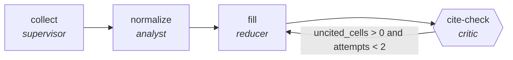

<!-- generated by scripts/gen_cards.py — edit graph.yaml / usecases/catalog.yaml, then `uv run python scripts/gen_cards.py` -->
# 🪪 AGR-044 · `vendor-comparison-matrix`

> Build a like-for-like vendor matrix where every cell cites the source document it came from.

| Card ID | Domain | Pattern | Nodes | Edges | Verifiers | Routers | Max steps | Risk surface |
|---|---|---|---|---|---|---|---|---|
| `AGR-044` | business-ops | **parallel-swarm** | 4 | 4 | 1 | 0 | 25 | write |

## The graph



Legend: `[/…/]` router · `{{…}}` verifier · `[…]` worker/agent node.

## What it does

Workers score vendors per criterion from evidence.

## Why it should deliver results

Independent workers cover disjoint slices of the input at the same time. Because they cannot see each other's drafts, agreement is evidence and disagreement surfaces blind spots; the aggregator merges with explicit rules. Wall-clock time is roughly the slowest worker, not the sum.

- **Exit contract** — every matrix cell cites its source and all vendors share one criteria set
- **Machine-checked** — `output.uncited_cells == 0`
- **Machine-checked** — `output.criteria_consistent == true`
- **Bounded** — hard stop after 25 steps; every loop edge is condition-guarded
- **Golden cases** — `uv run agr eval vendor-comparison-matrix` replays recorded cases through the real edge/assert logic (mock runner proves mechanics; `--live` measures your model)
- **Trace gallery** — [every case's route, node outputs, and checked asserts](../../../docs/traces/vendor-comparison-matrix.md)

## How to work with it

```bash
uv run agr show vendor-comparison-matrix       # full definition
uv run agr profile vendor-comparison-matrix    # deterministic structural facts
uv run agr mermaid vendor-comparison-matrix    # regenerate the diagram below
uv run agr eval vendor-comparison-matrix       # run golden cases (add --live for your endpoint)
uv run agr adapt vendor-comparison-matrix --target langgraph > app.py   # compile to runnable LangGraph
uv run agr optimize vendor-comparison-matrix   # propose bounded structural improvements (dry-run)
```

Over MCP: `uv run agr mcp` exposes the registry (search / show / profile) to any MCP client.
To evolve it: `uv run agr infuse vendor-comparison-matrix <node> <ability>` — every mutation is gate-checked and appended to the graph's lineage log.

## Node roster

| Node | Speciality | Kind | Abilities |
|---|---|---|---|
| `collect` | supervisor | subgraph | — |
| `normalize` | analyst | agent | analyze |
| `fill` | reducer | agent | reduce_merge |
| `cite-check` | critic | verifier | critique |

## Edge logic

| From | To | Condition |
|---|---|---|
| `collect` | `normalize` | always |
| `normalize` | `fill` | always |
| `fill` | `cite-check` | always |
| `cite-check` | `fill` | uncited_cells > 0 and attempts < 2 |

## Optional use-cases

Adjacent entries from the use-case catalog this card adapts to with small edits:

- **okr-drafting-debate** (business-ops, debate) — Ambition versus feasibility advocates converge on OKRs. *Verify:* each KR is measurable with a data source named.
- **process-documentation-miner** (business-ops, map-reduce) — Mine tickets and chats to document the de facto process. *Verify:* steps corroborated by at least two sources.
- **brand-consistency-audit** (content-marketing, parallel-swarm) — Workers audit assets against voice and visual guidelines. *Verify:* violations reported per asset with rule ids.
- **regulatory-filing-check** (finance, parallel-swarm) — Workers check filing sections against requirement checklists. *Verify:* every checklist item pass or fail with location.
- **supply-chain-audit** (security, parallel-swarm) — Workers audit dependencies for provenance and tampering. *Verify:* attestations verified; unsigned artifacts listed.

---
*Regenerate: `uv run python scripts/gen_cards.py` · Index: [CARDS.md](../../../CARDS.md)*
