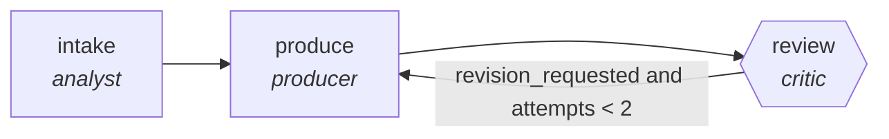

<!-- generated by scripts/gen_cards.py — edit graph.yaml / usecases/catalog.yaml, then `uv run python scripts/gen_cards.py` -->
# 🪪 AGR-034 · `blog-production-pipeline`

> Brief to outline to draft to edit to publish-ready post.

| Card ID | Domain | Pattern | Nodes | Edges | Verifiers | Routers | Max steps | Risk surface |
|---|---|---|---|---|---|---|---|---|
| `AGR-034` | content-marketing | **pipeline** | 3 | 3 | 1 | 0 | 12 | write |

> 🎯 **Requires a goal** — the content brief to develop and the audience it targets. Without one the graph refuses and runs no node.

## The graph



Legend: `[/…/]` router · `{{…}}` verifier · `[…]` worker/agent node.

## What it does

Brief to outline to draft to edit to publish-ready post.

## Why it should deliver results

Staged specialists each own one narrow concern, so quality problems are localized to the stage that produced them instead of being smeared across a single mega-prompt. Output only leaves the graph through the exit contract.

- **Exit contract** — style guide lint passes; plagiarism scan clean
- **Machine-checked** — `output.lint_passed and output.plagiarism_clean`
- **Bounded** — hard stop after 12 steps; every loop edge is condition-guarded
- **Golden cases** — `uv run agr eval blog-production-pipeline` replays recorded cases through the real edge/assert logic (mock runner proves mechanics; `--live` measures your model)
- **Trace gallery** — [every case's route, node outputs, and checked asserts](../../../docs/traces/blog-production-pipeline.md)

## How to work with it

```bash
uv run agr show blog-production-pipeline       # full definition
uv run agr profile blog-production-pipeline    # deterministic structural facts
uv run agr mermaid blog-production-pipeline    # regenerate the diagram below
uv run agr eval blog-production-pipeline       # run golden cases (add --live for your endpoint)
uv run agr adapt blog-production-pipeline --target langgraph > app.py   # compile to runnable LangGraph
uv run agr optimize blog-production-pipeline   # propose bounded structural improvements (dry-run)
```

Over MCP: `uv run agr mcp` exposes the registry (search / show / profile) to any MCP client.
To evolve it: `uv run agr infuse blog-production-pipeline <node> <ability>` — every mutation is gate-checked and appended to the graph's lineage log.

## Node roster

| Node | Speciality | Kind | Abilities |
|---|---|---|---|
| `intake` | analyst | agent | analyze |
| `produce` | producer | agent | generate |
| `review` | critic | verifier | critique |

## Edge logic

| From | To | Condition |
|---|---|---|
| `intake` | `produce` | always |
| `produce` | `review` | always |
| `review` | `produce` | revision_requested and attempts < 2 |

## Optional use-cases

Adjacent entries from the use-case catalog this card adapts to with small edits:

- **ad-variant-tournament** (content-marketing, generator-critic) — Generate ad variants, critic ranks against brand and claim rules. *Verify:* surviving variants pass legal claim checklist.
- **brand-consistency-audit** (content-marketing, parallel-swarm) — Workers audit assets against voice and visual guidelines. *Verify:* violations reported per asset with rule ids.
- **social-campaign-planner** (content-marketing, planner-executor-verifier) — Plan a campaign calendar, draft posts, verify constraints. *Verify:* calendar has no channel conflicts; lengths within limits.
- **newsletter-assembler** (content-marketing, map-reduce) — Summarize the period's items, reduce into sections. *Verify:* every item links its source; dead links zero.
- **video-script-writer** (content-marketing, generator-critic) — Script drafts critiqued for hook, pacing, and claim accuracy. *Verify:* runtime estimate within brief; claims sourced.

---
*Regenerate: `uv run python scripts/gen_cards.py` · Index: [CARDS.md](../../../CARDS.md)*
