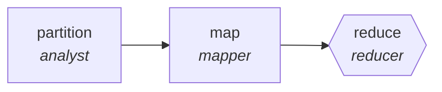

<!-- generated by scripts/gen_cards.py — edit graph.yaml / usecases/catalog.yaml, then `uv run python scripts/gen_cards.py` -->
# 🪪 AGR-038 · `localization-pipeline`

> Translate per locale, reduce into a consistency report.

| Card ID | Domain | Pattern | Nodes | Edges | Verifiers | Routers | Max steps | Risk surface |
|---|---|---|---|---|---|---|---|---|
| `AGR-038` | content-marketing | **map-reduce** | 3 | 2 | 1 | 0 | 20 | write |

## The graph



Legend: `[/…/]` router · `{{…}}` verifier · `[…]` worker/agent node.

## What it does

Translate per locale, reduce into a consistency report.

## Why it should deliver results

Work fans out over shards and the reduce step merges with explicit dedupe and conflict rules, so throughput scales with shard count while the output stays a single consistent artifact.

- **Exit contract** — back-translation similarity above threshold; glossary respected
- **Machine-checked** — `back-translation similarity above threshold; glossary respected`
- **Bounded** — hard stop after 20 steps; the topology is acyclic
- **Gate-checked** — schema + lint + structural gate run in CI; golden eval cases are the next step for this card (see `evals/` for the format)

## How to work with it

```bash
uv run agr show localization-pipeline       # full definition
uv run agr profile localization-pipeline    # deterministic structural facts
uv run agr mermaid localization-pipeline    # regenerate the diagram below
uv run agr adapt localization-pipeline --target langgraph > app.py   # compile to runnable LangGraph
uv run agr optimize localization-pipeline   # propose bounded structural improvements (dry-run)
```

Over MCP: `uv run agr mcp` exposes the registry (search / show / profile) to any MCP client.
To evolve it: `uv run agr infuse localization-pipeline <node> <ability>` — every mutation is gate-checked and appended to the graph's lineage log.

## Node roster

| Node | Speciality | Kind | Abilities |
|---|---|---|---|
| `partition` | analyst | agent | analyze |
| `map` | mapper | agent | map_shard |
| `reduce` | reducer | verifier | reduce_merge |

## Edge logic

| From | To | Condition |
|---|---|---|
| `partition` | `map` | always |
| `map` | `reduce` | always |

## Optional use-cases

Adjacent entries from the use-case catalog this card adapts to with small edits:

- **ad-variant-tournament** (content-marketing, generator-critic) — Generate ad variants, critic ranks against brand and claim rules. *Verify:* surviving variants pass legal claim checklist.
- **brand-consistency-audit** (content-marketing, parallel-swarm) — Workers audit assets against voice and visual guidelines. *Verify:* violations reported per asset with rule ids.
- **social-campaign-planner** (content-marketing, planner-executor-verifier) — Plan a campaign calendar, draft posts, verify constraints. *Verify:* calendar has no channel conflicts; lengths within limits.
- **newsletter-assembler** (content-marketing, map-reduce) — Summarize the period's items, reduce into sections. *Verify:* every item links its source; dead links zero.
- **video-script-writer** (content-marketing, generator-critic) — Script drafts critiqued for hook, pacing, and claim accuracy. *Verify:* runtime estimate within brief; claims sourced.

---
*Regenerate: `uv run python scripts/gen_cards.py` · Index: [CARDS.md](../../../CARDS.md)*
