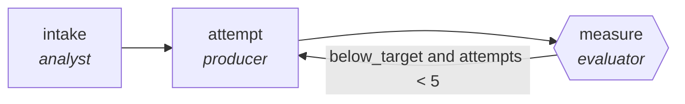

<!-- generated by scripts/gen_cards.py — edit graph.yaml / usecases/catalog.yaml, then `uv run python scripts/gen_cards.py` -->
# 🪪 AGR-035 · `seo-optimization-loop`

> Rewrite for target queries, re-score, iterate to threshold.

| Card ID | Domain | Pattern | Nodes | Edges | Verifiers | Routers | Max steps | Risk surface |
|---|---|---|---|---|---|---|---|---|
| `AGR-035` | content-marketing | **loop** | 3 | 3 | 1 | 0 | 15 | write |

## The graph



Legend: `[/…/]` router · `{{…}}` verifier · `[…]` worker/agent node.

## What it does

Rewrite for target queries, re-score, iterate to threshold.

## Why it should deliver results

A bounded improve-and-measure cycle: each iteration must beat the last measured score or the loop exits. `max_steps` is a hard cap, so the graph can refine but never wander.

- **Exit contract** — seo score above threshold without keyword stuffing flags
- **Machine-checked** — `output.seo_score >= output.threshold and not output.stuffing_flags`
- **Bounded** — hard stop after 15 steps; every loop edge is condition-guarded
- **Golden cases** — `uv run agr eval seo-optimization-loop` replays recorded cases through the real edge/assert logic (mock runner proves mechanics; `--live` measures your model)
- **Trace gallery** — [every case's route, node outputs, and checked asserts](../../../docs/traces/seo-optimization-loop.md)

## How to work with it

```bash
uv run agr show seo-optimization-loop       # full definition
uv run agr profile seo-optimization-loop    # deterministic structural facts
uv run agr mermaid seo-optimization-loop    # regenerate the diagram below
uv run agr eval seo-optimization-loop       # run golden cases (add --live for your endpoint)
uv run agr adapt seo-optimization-loop --target langgraph > app.py   # compile to runnable LangGraph
uv run agr optimize seo-optimization-loop   # propose bounded structural improvements (dry-run)
```

Over MCP: `uv run agr mcp` exposes the registry (search / show / profile) to any MCP client.
To evolve it: `uv run agr infuse seo-optimization-loop <node> <ability>` — every mutation is gate-checked and appended to the graph's lineage log.

## Node roster

| Node | Speciality | Kind | Abilities |
|---|---|---|---|
| `intake` | analyst | agent | analyze |
| `attempt` | producer | agent | generate |
| `measure` | evaluator | verifier | evaluate |

## Edge logic

| From | To | Condition |
|---|---|---|
| `intake` | `attempt` | always |
| `attempt` | `measure` | always |
| `measure` | `attempt` | below_target and attempts < 5 |

## Optional use-cases

Adjacent entries from the use-case catalog this card adapts to with small edits:

- **ad-variant-tournament** (content-marketing, generator-critic) — Generate ad variants, critic ranks against brand and claim rules. *Verify:* surviving variants pass legal claim checklist.
- **brand-consistency-audit** (content-marketing, parallel-swarm) — Workers audit assets against voice and visual guidelines. *Verify:* violations reported per asset with rule ids.
- **social-campaign-planner** (content-marketing, planner-executor-verifier) — Plan a campaign calendar, draft posts, verify constraints. *Verify:* calendar has no channel conflicts; lengths within limits.
- **newsletter-assembler** (content-marketing, map-reduce) — Summarize the period's items, reduce into sections. *Verify:* every item links its source; dead links zero.
- **video-script-writer** (content-marketing, generator-critic) — Script drafts critiqued for hook, pacing, and claim accuracy. *Verify:* runtime estimate within brief; claims sourced.

---
*Regenerate: `uv run python scripts/gen_cards.py` · Index: [CARDS.md](../../../CARDS.md)*
