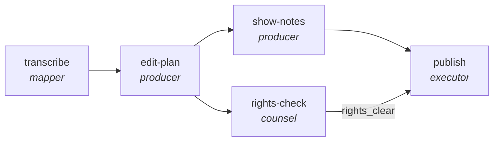

<!-- generated by scripts/gen_cards.py — edit graph.yaml / usecases/catalog.yaml, then `uv run python scripts/gen_cards.py` -->
# 🪪 AGR-106 · `podcast-production-pipeline`

> Turn a raw recording into a published episode: transcript, edit plan, show notes, rights check, publish.

| Card ID | Domain | Pattern | Nodes | Edges | Verifiers | Routers | Max steps | Risk surface |
|---|---|---|---|---|---|---|---|---|
| `AGR-106` | creative-production | **pipeline** | 5 | 5 | 0 | 0 | 30 | execute |

> 🎯 **Requires a goal** — the episode transcript to work from and the show it belongs to. Without one the graph refuses and runs no node.

## The graph



Legend: `[/…/]` router · `{{…}}` verifier · `[…]` worker/agent node.

## What it does

Outline, script, edit, and show notes with links.

## Why it should deliver results

Staged specialists each own one narrow concern, so quality problems are localized to the stage that produced them instead of being smeared across a single mega-prompt. Output only leaves the graph through the exit contract.

- **Exit contract** — no episode publishes with an uncleared cue or drifting timestamps
- **Machine-checked** — `all(c.license_ref for c in output.clearances)`
- **Machine-checked** — `all(t.start < t.end for t in output.timestamps)`
- **Bounded** — hard stop after 30 steps; the topology is acyclic
- **Golden cases** — `uv run agr eval podcast-production-pipeline` replays recorded cases through the real edge/assert logic (mock runner proves mechanics; `--live` measures your model)
- **Trace gallery** — [every case's route, node outputs, and checked asserts](../../../docs/traces/podcast-production-pipeline.md)

## How to work with it

```bash
uv run agr show podcast-production-pipeline       # full definition
uv run agr profile podcast-production-pipeline    # deterministic structural facts
uv run agr mermaid podcast-production-pipeline    # regenerate the diagram below
uv run agr eval podcast-production-pipeline       # run golden cases (add --live for your endpoint)
uv run agr adapt podcast-production-pipeline --target langgraph > app.py   # compile to runnable LangGraph
uv run agr optimize podcast-production-pipeline   # propose bounded structural improvements (dry-run)
```

Over MCP: `uv run agr mcp` exposes the registry (search / show / profile) to any MCP client.
To evolve it: `uv run agr infuse podcast-production-pipeline <node> <ability>` — every mutation is gate-checked and appended to the graph's lineage log.

## Node roster

| Node | Speciality | Kind | Abilities |
|---|---|---|---|
| `transcribe` | mapper | agent | map_shard |
| `edit-plan` | producer | agent | generate |
| `show-notes` | producer | agent | generate |
| `rights-check` | counsel | agent | critique |
| `publish` | executor | agent | execute_step |

## Edge logic

| From | To | Condition |
|---|---|---|
| `transcribe` | `edit-plan` | always |
| `edit-plan` | `show-notes` | always |
| `edit-plan` | `rights-check` | always |
| `show-notes` | `publish` | always |
| `rights-check` | `publish` | rights_clear |

## Optional use-cases

Adjacent entries from the use-case catalog this card adapts to with small edits:

- **game-npc-dialogue** (creative-production, generator-critic) — Generate branching dialogue, critic checks lore and tone. *Verify:* branches validate against dialogue schema; lore conflicts zero.
- **level-design-review** (creative-production, debate) — Difficulty versus flow advocates review a level design. *Verify:* playtest checklist complete; blockers enumerated.
- **image-asset-qa** (creative-production, parallel-swarm) — Workers check assets for spec, licensing, and artifacts. *Verify:* every asset pass or fail with rule id.
- **music-metadata-tagging** (creative-production, map-reduce) — Tag tracks with genre, mood, and rights metadata. *Verify:* tags validate against controlled vocabulary.
- **cloud-cost-optimizer** (devops-sre, pipeline) — Scan usage, propose rightsizing, verify against SLO headroom. *Verify:* projected savings computed from real billing export.

---
*Regenerate: `uv run python scripts/gen_cards.py` · Index: [CARDS.md](../../../CARDS.md)*
