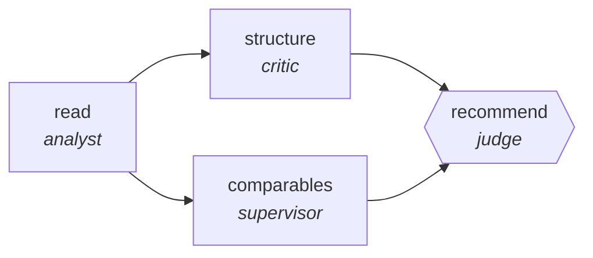

<!-- generated by scripts/gen_cards.py — edit graph.yaml / usecases/catalog.yaml, then `uv run python scripts/gen_cards.py` -->
# 🪪 AGR-105 · `screenplay-coverage`

> Produce studio-standard coverage: synopsis, structural analysis, comparables, and a defended recommendation.

| Card ID | Domain | Pattern | Nodes | Edges | Verifiers | Routers | Max steps | Risk surface |
|---|---|---|---|---|---|---|---|---|
| `AGR-105` | creative-production | **pipeline** | 4 | 4 | 1 | 0 | 25 | read |

> 🎯 **Requires a goal** — the screenplay to cover and the mandate it is being read against. Without one the graph refuses and runs no node.

## The graph



Legend: `[/…/]` router · `{{…}}` verifier · `[…]` worker/agent node.

## What it does

Read script, produce coverage with comps and verdict.

## Why it should deliver results

Staged specialists each own one narrow concern, so quality problems are localized to the stage that produced them instead of being smeared across a single mega-prompt. Output only leaves the graph through the exit contract.

- **Exit contract** — coverage lands one of three verdicts, defended against at least two named comparables
- **Machine-checked** — `output.recommendation in ['pass','consider','recommend']`
- **Machine-checked** — `len(output.comps) >= 2`
- **Bounded** — hard stop after 25 steps; the topology is acyclic
- **Golden cases** — `uv run agr eval screenplay-coverage` replays recorded cases through the real edge/assert logic (mock runner proves mechanics; `--live` measures your model)
- **Trace gallery** — [every case's route, node outputs, and checked asserts](../../../docs/traces/screenplay-coverage.md)

## How to work with it

```bash
uv run agr show screenplay-coverage       # full definition
uv run agr profile screenplay-coverage    # deterministic structural facts
uv run agr mermaid screenplay-coverage    # regenerate the diagram below
uv run agr eval screenplay-coverage       # run golden cases (add --live for your endpoint)
uv run agr adapt screenplay-coverage --target langgraph > app.py   # compile to runnable LangGraph
uv run agr optimize screenplay-coverage   # propose bounded structural improvements (dry-run)
```

Over MCP: `uv run agr mcp` exposes the registry (search / show / profile) to any MCP client.
To evolve it: `uv run agr infuse screenplay-coverage <node> <ability>` — every mutation is gate-checked and appended to the graph's lineage log.

## Node roster

| Node | Speciality | Kind | Abilities |
|---|---|---|---|
| `read` | analyst | agent | analyze |
| `structure` | critic | agent | critique |
| `comparables` | supervisor | subgraph | — |
| `recommend` | judge | verifier | adjudicate |

## Edge logic

| From | To | Condition |
|---|---|---|
| `read` | `structure` | always |
| `read` | `comparables` | always |
| `structure` | `recommend` | always |
| `comparables` | `recommend` | always |

## Optional use-cases

Adjacent entries from the use-case catalog this card adapts to with small edits:

- **game-npc-dialogue** (creative-production, generator-critic) — Generate branching dialogue, critic checks lore and tone. *Verify:* branches validate against dialogue schema; lore conflicts zero.
- **level-design-review** (creative-production, debate) — Difficulty versus flow advocates review a level design. *Verify:* playtest checklist complete; blockers enumerated.
- **image-asset-qa** (creative-production, parallel-swarm) — Workers check assets for spec, licensing, and artifacts. *Verify:* every asset pass or fail with rule id.
- **music-metadata-tagging** (creative-production, map-reduce) — Tag tracks with genre, mood, and rights metadata. *Verify:* tags validate against controlled vocabulary.
- **cloud-cost-optimizer** (devops-sre, pipeline) — Scan usage, propose rightsizing, verify against SLO headroom. *Verify:* projected savings computed from real billing export.

---
*Regenerate: `uv run python scripts/gen_cards.py` · Index: [CARDS.md](../../../CARDS.md)*
