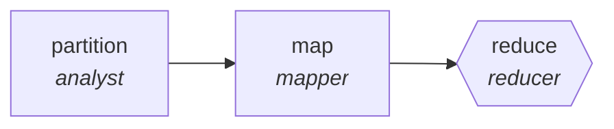

<!-- generated by scripts/gen_cards.py — edit graph.yaml / usecases/catalog.yaml, then `uv run python scripts/gen_cards.py` -->
# 🪪 AGR-110 · `ux-research-synthesis`

> Code interview transcripts, reduce to themed insights.

| Card ID | Domain | Pattern | Nodes | Edges | Verifiers | Routers | Max steps | Risk surface |
|---|---|---|---|---|---|---|---|---|
| `AGR-110` | creative-production | **map-reduce** | 3 | 2 | 1 | 0 | 20 | write |

## The graph



Legend: `[/…/]` router · `{{…}}` verifier · `[…]` worker/agent node.

## What it does

Code interview transcripts, reduce to themed insights.

## Why it should deliver results

Work fans out over shards and the reduce step merges with explicit dedupe and conflict rules, so throughput scales with shard count while the output stays a single consistent artifact.

- **Exit contract** — every insight cites at least two participants
- **Machine-checked** — `all(i.participant_ids[1:] for i in output.insights)`
- **Bounded** — hard stop after 20 steps; the topology is acyclic
- **Golden cases** — `uv run agr eval ux-research-synthesis` replays recorded cases through the real edge/assert logic (mock runner proves mechanics; `--live` measures your model)
- **Trace gallery** — [every case's route, node outputs, and checked asserts](../../../docs/traces/ux-research-synthesis.md)

## How to work with it

```bash
uv run agr show ux-research-synthesis       # full definition
uv run agr profile ux-research-synthesis    # deterministic structural facts
uv run agr mermaid ux-research-synthesis    # regenerate the diagram below
uv run agr eval ux-research-synthesis       # run golden cases (add --live for your endpoint)
uv run agr adapt ux-research-synthesis --target langgraph > app.py   # compile to runnable LangGraph
uv run agr optimize ux-research-synthesis   # propose bounded structural improvements (dry-run)
```

Over MCP: `uv run agr mcp` exposes the registry (search / show / profile) to any MCP client.
To evolve it: `uv run agr infuse ux-research-synthesis <node> <ability>` — every mutation is gate-checked and appended to the graph's lineage log.

## Node roster

| Node | Speciality | Kind | Abilities |
|---|---|---|---|
| `partition` | analyst | agent | analyze |
| `map` | mapper | agent | map_shard |
| `reduce` | reducer | verifier | reduce_merge |

## Edge logic

| From | To | Condition |
|---|---|---|
| `partition` | `map` | always |
| `map` | `reduce` | always |

## Optional use-cases

Adjacent entries from the use-case catalog this card adapts to with small edits:

- **game-npc-dialogue** (creative-production, generator-critic) — Generate branching dialogue, critic checks lore and tone. *Verify:* branches validate against dialogue schema; lore conflicts zero.
- **level-design-review** (creative-production, debate) — Difficulty versus flow advocates review a level design. *Verify:* playtest checklist complete; blockers enumerated.
- **image-asset-qa** (creative-production, parallel-swarm) — Workers check assets for spec, licensing, and artifacts. *Verify:* every asset pass or fail with rule id.
- **music-metadata-tagging** (creative-production, map-reduce) — Tag tracks with genre, mood, and rights metadata. *Verify:* tags validate against controlled vocabulary.
- **data-catalog-enrichment** (data-analytics, map-reduce) — Describe every table and column, reduce into a searchable catalog. *Verify:* descriptions exist for all tables; lineage links resolve.

---
*Regenerate: `uv run python scripts/gen_cards.py` · Index: [CARDS.md](../../../CARDS.md)*
