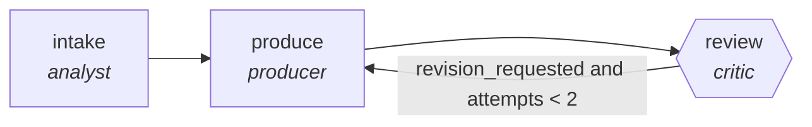

<!-- generated by scripts/gen_cards.py — edit graph.yaml / usecases/catalog.yaml, then `uv run python scripts/gen_cards.py` -->
# 🪪 AGR-078 · `kb-article-generator`

> Mine resolved tickets into draft knowledge-base articles.

| Card ID | Domain | Pattern | Nodes | Edges | Verifiers | Routers | Max steps | Risk surface |
|---|---|---|---|---|---|---|---|---|
| `AGR-078` | customer-support-sales | **pipeline** | 3 | 3 | 1 | 0 | 12 | write |

## The graph



Legend: `[/…/]` router · `{{…}}` verifier · `[…]` worker/agent node.

## What it does

Mine resolved tickets into draft knowledge-base articles.

## Why it should deliver results

Staged specialists each own one narrow concern, so quality problems are localized to the stage that produced them instead of being smeared across a single mega-prompt. Output only leaves the graph through the exit contract.

- **Exit contract** — steps reproduce resolution; duplicates deduped
- **Machine-checked** — `output.reproduces_resolution and output.duplicates_deduped`
- **Bounded** — hard stop after 12 steps; every loop edge is condition-guarded
- **Golden cases** — `uv run agr eval kb-article-generator` replays recorded cases through the real edge/assert logic (mock runner proves mechanics; `--live` measures your model)
- **Trace gallery** — [every case's route, node outputs, and checked asserts](../../../docs/traces/kb-article-generator.md)

## How to work with it

```bash
uv run agr show kb-article-generator       # full definition
uv run agr profile kb-article-generator    # deterministic structural facts
uv run agr mermaid kb-article-generator    # regenerate the diagram below
uv run agr eval kb-article-generator       # run golden cases (add --live for your endpoint)
uv run agr adapt kb-article-generator --target langgraph > app.py   # compile to runnable LangGraph
uv run agr optimize kb-article-generator   # propose bounded structural improvements (dry-run)
```

Over MCP: `uv run agr mcp` exposes the registry (search / show / profile) to any MCP client.
To evolve it: `uv run agr infuse kb-article-generator <node> <ability>` — every mutation is gate-checked and appended to the graph's lineage log.

## Node roster

| Node | Speciality | Kind | Abilities |
|---|---|---|---|
| `intake` | analyst | agent | analyze |
| `produce` | producer | agent | generate |
| `review` | critic | verifier | critique |

## Edge logic

| From | To | Condition |
|---|---|---|
| `intake` | `produce` | always |
| `produce` | `review` | always |
| `review` | `produce` | revision_requested and attempts < 2 |

## Optional use-cases

Adjacent entries from the use-case catalog this card adapts to with small edits:

- **churn-signal-analysis** (customer-support-sales, map-reduce) — Aggregate account signals, reduce to ranked churn risks. *Verify:* every risk factor cites underlying events.
- **crm-enrichment-pipeline** (customer-support-sales, pipeline) — Fill CRM gaps from public sources with provenance. *Verify:* each field carries source URL and timestamp.
- **sales-call-scorer** (customer-support-sales, parallel-swarm) — Workers score calls per methodology dimension. *Verify:* scores cite transcript spans; calibration checked.
- **quote-configurator** (customer-support-sales, pipeline) — Assemble quotes against price book and discount policy. *Verify:* totals recompute exactly; policy violations zero.
- **cloud-cost-optimizer** (devops-sre, pipeline) — Scan usage, propose rightsizing, verify against SLO headroom. *Verify:* projected savings computed from real billing export.

---
*Regenerate: `uv run python scripts/gen_cards.py` · Index: [CARDS.md](../../../CARDS.md)*
