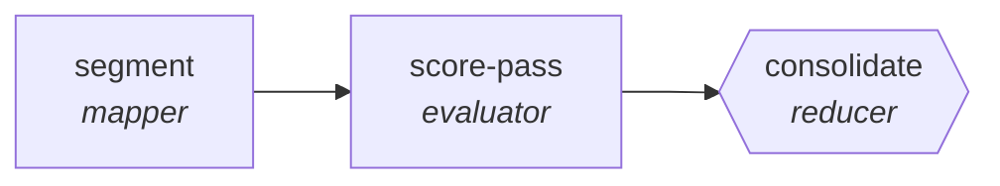

<!-- generated by scripts/gen_cards.py — edit graph.yaml / usecases/catalog.yaml, then `uv run python scripts/gen_cards.py` -->
# 🪪 AGR-082 · `sales-call-scorer`

> Score a call against a rubric from several independent passes, reporting variance as a confidence signal.

| Card ID | Domain | Pattern | Nodes | Edges | Verifiers | Routers | Max steps | Risk surface |
|---|---|---|---|---|---|---|---|---|
| `AGR-082` | customer-support-sales | **parallel-swarm** | 3 | 2 | 1 | 0 | 30 | write |

> 🎯 **Requires a goal** — the call transcript to score and the rubric to score it against. Without one the graph refuses and runs no node.

## The graph



Legend: `[/…/]` router · `{{…}}` verifier · `[…]` worker/agent node.

## What it does

Workers score calls per methodology dimension.

## Why it should deliver results

Independent workers cover disjoint slices of the input at the same time. Because they cannot see each other's drafts, agreement is evidence and disagreement surfaces blind spots; the aggregator merges with explicit rules. Wall-clock time is roughly the slowest worker, not the sum.

- **Exit contract** — the score reports the spread between passes alongside the median
- **Machine-checked** — `output.segments_scored >= 1`
- **Machine-checked** — `output.variance is not None`
- **Bounded** — hard stop after 30 steps; the topology is acyclic
- **Golden cases** — `uv run agr eval sales-call-scorer` replays recorded cases through the real edge/assert logic (mock runner proves mechanics; `--live` measures your model)
- **Trace gallery** — [every case's route, node outputs, and checked asserts](../../../docs/traces/sales-call-scorer.md)

## How to work with it

```bash
uv run agr show sales-call-scorer       # full definition
uv run agr profile sales-call-scorer    # deterministic structural facts
uv run agr mermaid sales-call-scorer    # regenerate the diagram below
uv run agr eval sales-call-scorer       # run golden cases (add --live for your endpoint)
uv run agr adapt sales-call-scorer --target langgraph > app.py   # compile to runnable LangGraph
uv run agr optimize sales-call-scorer   # propose bounded structural improvements (dry-run)
```

Over MCP: `uv run agr mcp` exposes the registry (search / show / profile) to any MCP client.
To evolve it: `uv run agr infuse sales-call-scorer <node> <ability>` — every mutation is gate-checked and appended to the graph's lineage log.

## Node roster

| Node | Speciality | Kind | Abilities |
|---|---|---|---|
| `segment` | mapper | agent | map_shard |
| `score-pass` | evaluator | agent | evaluate |
| `consolidate` | reducer | verifier | reduce_merge |

## Edge logic

| From | To | Condition |
|---|---|---|
| `segment` | `score-pass` | always |
| `score-pass` | `consolidate` | always |

## Optional use-cases

Adjacent entries from the use-case catalog this card adapts to with small edits:

- **churn-signal-analysis** (customer-support-sales, map-reduce) — Aggregate account signals, reduce to ranked churn risks. *Verify:* every risk factor cites underlying events.
- **crm-enrichment-pipeline** (customer-support-sales, pipeline) — Fill CRM gaps from public sources with provenance. *Verify:* each field carries source URL and timestamp.
- **quote-configurator** (customer-support-sales, pipeline) — Assemble quotes against price book and discount policy. *Verify:* totals recompute exactly; policy violations zero.
- **brand-consistency-audit** (content-marketing, parallel-swarm) — Workers audit assets against voice and visual guidelines. *Verify:* violations reported per asset with rule ids.
- **regulatory-filing-check** (finance, parallel-swarm) — Workers check filing sections against requirement checklists. *Verify:* every checklist item pass or fail with location.

---
*Regenerate: `uv run python scripts/gen_cards.py` · Index: [CARDS.md](../../../CARDS.md)*
