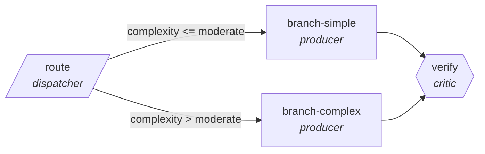

<!-- generated by scripts/gen_cards.py — edit graph.yaml / usecases/catalog.yaml, then `uv run python scripts/gen_cards.py` -->
# 🪪 AGR-077 · `ticket-triage-swarm`

> Classify and route tickets with priority and sentiment.

| Card ID | Domain | Pattern | Nodes | Edges | Verifiers | Routers | Max steps | Risk surface |
|---|---|---|---|---|---|---|---|---|
| `AGR-077` | customer-support-sales | **router** | 4 | 4 | 1 | 1 | 12 | write |

> 🎯 **Requires a goal** — the tickets to triage and the queue ownership map to route by. Without one the graph refuses and runs no node.

## The graph



Legend: `[/…/]` router · `{{…}}` verifier · `[…]` worker/agent node.

## What it does

Classify and route tickets with priority and sentiment.

## Why it should deliver results

A cheap classifier sends every item down the narrowest branch that can handle it, so cost and latency scale with the difficulty of each item rather than the worst case. Escalation edges guarantee hard items still reach the strong path.

- **Exit contract** — routing accuracy measured on labeled backlog
- **Machine-checked** — `output.assigned_queue == output.expected_queue`
- **Machine-checked** — `len(output.expected_queue) > 0`
- **Bounded** — hard stop after 12 steps; the topology is acyclic
- **Golden cases** — `uv run agr eval ticket-triage-swarm` replays recorded cases through the real edge/assert logic (mock runner proves mechanics; `--live` measures your model)
- **Trace gallery** — [every case's route, node outputs, and checked asserts](../../../docs/traces/ticket-triage-swarm.md)

## How to work with it

```bash
uv run agr show ticket-triage-swarm       # full definition
uv run agr profile ticket-triage-swarm    # deterministic structural facts
uv run agr mermaid ticket-triage-swarm    # regenerate the diagram below
uv run agr eval ticket-triage-swarm       # run golden cases (add --live for your endpoint)
uv run agr adapt ticket-triage-swarm --target langgraph > app.py   # compile to runnable LangGraph
uv run agr optimize ticket-triage-swarm   # propose bounded structural improvements (dry-run)
```

Over MCP: `uv run agr mcp` exposes the registry (search / show / profile) to any MCP client.
To evolve it: `uv run agr infuse ticket-triage-swarm <node> <ability>` — every mutation is gate-checked and appended to the graph's lineage log.

## Node roster

| Node | Speciality | Kind | Abilities |
|---|---|---|---|
| `route` | dispatcher | router | dispatch |
| `branch-simple` | producer | agent | generate |
| `branch-complex` | producer | agent | generate |
| `verify` | critic | verifier | critique |

## Edge logic

| From | To | Condition |
|---|---|---|
| `route` | `branch-simple` | complexity <= moderate |
| `route` | `branch-complex` | complexity > moderate |
| `branch-simple` | `verify` | always |
| `branch-complex` | `verify` | always |

## Optional use-cases

Adjacent entries from the use-case catalog this card adapts to with small edits:

- **churn-signal-analysis** (customer-support-sales, map-reduce) — Aggregate account signals, reduce to ranked churn risks. *Verify:* every risk factor cites underlying events.
- **crm-enrichment-pipeline** (customer-support-sales, pipeline) — Fill CRM gaps from public sources with provenance. *Verify:* each field carries source URL and timestamp.
- **quote-configurator** (customer-support-sales, pipeline) — Assemble quotes against price book and discount policy. *Verify:* totals recompute exactly; policy violations zero.
- **fraud-pattern-triage** (finance, router) — Route flagged transactions to rule, anomaly, or manual review. *Verify:* routing precision measured against labeled history.
- **tutoring-router** (education, router) — Route learner questions by topic and difficulty to tutors. *Verify:* routing matches topic taxonomy on holdout set.

---
*Regenerate: `uv run python scripts/gen_cards.py` · Index: [CARDS.md](../../../CARDS.md)*
