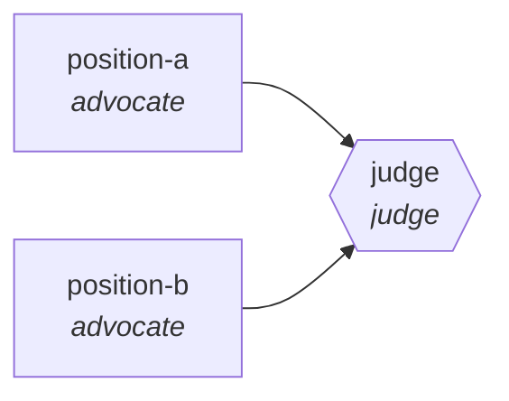

<!-- generated by scripts/gen_cards.py — edit graph.yaml / usecases/catalog.yaml, then `uv run python scripts/gen_cards.py` -->
# 🪪 AGR-024 · `ab-test-analysis`

> Two analysts argue significance and pitfalls, judge writes readout.

| Card ID | Domain | Pattern | Nodes | Edges | Verifiers | Routers | Max steps | Risk surface |
|---|---|---|---|---|---|---|---|---|
| `AGR-024` | data-analytics | **debate** | 3 | 2 | 1 | 0 | 8 | write |

## The graph



Legend: `[/…/]` router · `{{…}}` verifier · `[…]` worker/agent node.

## What it does

Two analysts argue significance and pitfalls, judge writes readout.

## Why it should deliver results

Adversarial positions force every claim to survive counter-argument before a judge selects with cited evidence — a structural antidote to sycophancy and single-model anchoring.

- **Exit contract** — stats recomputed from raw data reproduce claimed effect
- **Machine-checked** — `stats recomputed from raw data reproduce claimed effect`
- **Bounded** — hard stop after 8 steps; the topology is acyclic
- **Gate-checked** — schema + lint + structural gate run in CI; golden eval cases are the next step for this card (see `evals/` for the format)

## How to work with it

```bash
uv run agr show ab-test-analysis       # full definition
uv run agr profile ab-test-analysis    # deterministic structural facts
uv run agr mermaid ab-test-analysis    # regenerate the diagram below
uv run agr adapt ab-test-analysis --target langgraph > app.py   # compile to runnable LangGraph
uv run agr optimize ab-test-analysis   # propose bounded structural improvements (dry-run)
```

Over MCP: `uv run agr mcp` exposes the registry (search / show / profile) to any MCP client.
To evolve it: `uv run agr infuse ab-test-analysis <node> <ability>` — every mutation is gate-checked and appended to the graph's lineage log.

## Node roster

| Node | Speciality | Kind | Abilities |
|---|---|---|---|
| `position-a` | advocate | agent | generate |
| `position-b` | advocate | agent | generate |
| `judge` | judge | verifier | adjudicate |

## Edge logic

| From | To | Condition |
|---|---|---|
| `position-a` | `judge` | always |
| `position-b` | `judge` | always |

## Optional use-cases

Adjacent entries from the use-case catalog this card adapts to with small edits:

- **dashboard-builder** (data-analytics, pipeline) — From metric spec to working dashboard with tested queries. *Verify:* every panel query executes under latency budget.
- **schema-migration-planner** (data-analytics, planner-executor-verifier) — Plan backward-compatible schema changes with shadow reads. *Verify:* shadow-read diff empty before cutover.
- **data-catalog-enrichment** (data-analytics, map-reduce) — Describe every table and column, reduce into a searchable catalog. *Verify:* descriptions exist for all tables; lineage links resolve.
- **api-design-review** (software-engineering, debate) — Two reviewers argue REST versus RPC tradeoffs, judge synthesizes. *Verify:* spec passes lint; breaking changes enumerated.
- **okr-drafting-debate** (business-ops, debate) — Ambition versus feasibility advocates converge on OKRs. *Verify:* each KR is measurable with a data source named.

---
*Regenerate: `uv run python scripts/gen_cards.py` · Index: [CARDS.md](../../../CARDS.md)*
