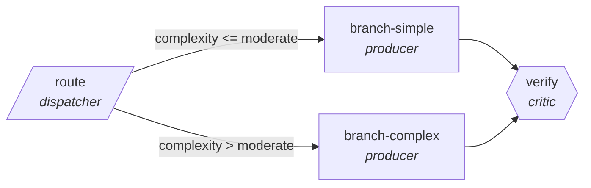

<!-- generated by scripts/gen_cards.py — edit graph.yaml / usecases/catalog.yaml, then `uv run python scripts/gen_cards.py` -->
# 🪪 AGR-023 · `anomaly-investigation`

> Route metric anomalies to seasonal, data-bug, or real-change analysts.

| Card ID | Domain | Pattern | Nodes | Edges | Verifiers | Routers | Max steps | Risk surface |
|---|---|---|---|---|---|---|---|---|
| `AGR-023` | data-analytics | **router** | 4 | 4 | 1 | 1 | 12 | write |

## The graph



Legend: `[/…/]` router · `{{…}}` verifier · `[…]` worker/agent node.

## What it does

Route metric anomalies to seasonal, data-bug, or real-change analysts.

## Why it should deliver results

A cheap classifier sends every item down the narrowest branch that can handle it, so cost and latency scale with the difficulty of each item rather than the worst case. Escalation edges guarantee hard items still reach the strong path.

- **Exit contract** — classification agrees with holdout labels
- **Machine-checked** — `output.matches_holdout`
- **Bounded** — hard stop after 12 steps; the topology is acyclic
- **Golden cases** — `uv run agr eval anomaly-investigation` replays recorded cases through the real edge/assert logic (mock runner proves mechanics; `--live` measures your model)
- **Trace gallery** — [every case's route, node outputs, and checked asserts](../../../docs/traces/anomaly-investigation.md)

## How to work with it

```bash
uv run agr show anomaly-investigation       # full definition
uv run agr profile anomaly-investigation    # deterministic structural facts
uv run agr mermaid anomaly-investigation    # regenerate the diagram below
uv run agr eval anomaly-investigation       # run golden cases (add --live for your endpoint)
uv run agr adapt anomaly-investigation --target langgraph > app.py   # compile to runnable LangGraph
uv run agr optimize anomaly-investigation   # propose bounded structural improvements (dry-run)
```

Over MCP: `uv run agr mcp` exposes the registry (search / show / profile) to any MCP client.
To evolve it: `uv run agr infuse anomaly-investigation <node> <ability>` — every mutation is gate-checked and appended to the graph's lineage log.

## Node roster

| Node | Speciality | Kind | Abilities |
|---|---|---|---|
| `route` | dispatcher | router | dispatch |
| `branch-simple` | producer | agent | generate |
| `branch-complex` | producer | agent | generate |
| `verify` | critic | verifier | critique |

## Edge logic

| From | To | Condition |
|---|---|---|
| `route` | `branch-simple` | complexity <= moderate |
| `route` | `branch-complex` | complexity > moderate |
| `branch-simple` | `verify` | always |
| `branch-complex` | `verify` | always |

## Optional use-cases

Adjacent entries from the use-case catalog this card adapts to with small edits:

- **dashboard-builder** (data-analytics, pipeline) — From metric spec to working dashboard with tested queries. *Verify:* every panel query executes under latency budget.
- **schema-migration-planner** (data-analytics, planner-executor-verifier) — Plan backward-compatible schema changes with shadow reads. *Verify:* shadow-read diff empty before cutover.
- **data-catalog-enrichment** (data-analytics, map-reduce) — Describe every table and column, reduce into a searchable catalog. *Verify:* descriptions exist for all tables; lineage links resolve.
- **invoice-reconciliation** (business-ops, router) — Match invoices to POs, route exceptions by mismatch type. *Verify:* matched set balances; exceptions carry mismatch reason.
- **fraud-pattern-triage** (finance, router) — Route flagged transactions to rule, anomaly, or manual review. *Verify:* routing precision measured against labeled history.

---
*Regenerate: `uv run python scripts/gen_cards.py` · Index: [CARDS.md](../../../CARDS.md)*
