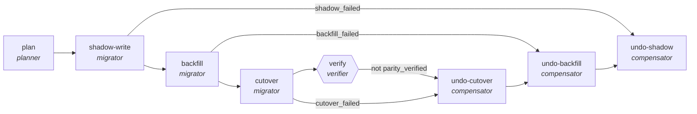

<!-- generated by scripts/gen_cards.py — edit graph.yaml / usecases/catalog.yaml, then `uv run python scripts/gen_cards.py` -->
# 🪪 AGR-118 · `schema-migration-saga`

> Migrate a schema in four reversible steps; any failure compensates back to a consistent state.

| Card ID | Domain | Pattern | Nodes | Edges | Verifiers | Routers | Max steps | Risk surface |
|---|---|---|---|---|---|---|---|---|
| `AGR-118` | data-analytics | **saga** | 8 | 10 | 1 | 0 | 40 | execute |

> 🎯 **Requires a goal** — the source schema and the target shape it must reach. Without one the graph refuses and runs no node.

## The graph



Legend: `[/…/]` router · `{{…}}` verifier · `[…]` worker/agent node.

## What it does

Migrate a schema in four reversible steps, compensating back to consistency on any failure.

## Why it should deliver results

Every forward step that writes has a paired compensator reachable by a `kind: compensate` edge, so a failure unwinds to a consistent state instead of leaving the system half-migrated. Lint refuses a saga whose execute-risk step has no compensator — the failure mode is caught at author time, not in prod.

- **Exit contract** — every forward step has a compensator; the saga ends verified or fully unwound
- **Machine-checked** — `output.parity_verified == true or output.consistent == true`
- **Bounded** — hard stop after 40 steps; the topology is acyclic
- **Golden cases** — `uv run agr eval schema-migration-saga` replays recorded cases through the real edge/assert logic (mock runner proves mechanics; `--live` measures your model)
- **Trace gallery** — [every case's route, node outputs, and checked asserts](../../../docs/traces/schema-migration-saga.md)

## How to work with it

```bash
uv run agr show schema-migration-saga       # full definition
uv run agr profile schema-migration-saga    # deterministic structural facts
uv run agr mermaid schema-migration-saga    # regenerate the diagram below
uv run agr eval schema-migration-saga       # run golden cases (add --live for your endpoint)
uv run agr adapt schema-migration-saga --target langgraph > app.py   # compile to runnable LangGraph
uv run agr optimize schema-migration-saga   # propose bounded structural improvements (dry-run)
```

Over MCP: `uv run agr mcp` exposes the registry (search / show / profile) to any MCP client.
To evolve it: `uv run agr infuse schema-migration-saga <node> <ability>` — every mutation is gate-checked and appended to the graph's lineage log.

## Node roster

| Node | Speciality | Kind | Abilities |
|---|---|---|---|
| `plan` | planner | agent | decompose_goal |
| `shadow-write` | migrator | agent | shadow_write, execute_step |
| `backfill` | migrator | agent | backfill, execute_step |
| `cutover` | migrator | agent | execute_step |
| `verify` | verifier | verifier | run_command |
| `undo-cutover` | compensator | agent | rollback |
| `undo-backfill` | compensator | agent | rollback |
| `undo-shadow` | compensator | agent | rollback |

## Edge logic

| From | To | Condition |
|---|---|---|
| `plan` | `shadow-write` | always |
| `shadow-write` | `backfill` | always |
| `backfill` | `cutover` | always |
| `cutover` | `verify` | always |
| `verify` | `undo-cutover` | not parity_verified |
| `cutover` | `undo-cutover` | cutover_failed |
| `backfill` | `undo-backfill` | backfill_failed |
| `shadow-write` | `undo-shadow` | shadow_failed |
| `undo-cutover` | `undo-backfill` | always |
| `undo-backfill` | `undo-shadow` | always |

## Optional use-cases

Adjacent entries from the use-case catalog this card adapts to with small edits:

- **dashboard-builder** (data-analytics, pipeline) — From metric spec to working dashboard with tested queries. *Verify:* every panel query executes under latency budget.
- **schema-migration-planner** (data-analytics, planner-executor-verifier) — Plan backward-compatible schema changes with shadow reads. *Verify:* shadow-read diff empty before cutover.
- **data-catalog-enrichment** (data-analytics, map-reduce) — Describe every table and column, reduce into a searchable catalog. *Verify:* descriptions exist for all tables; lineage links resolve.

---
*Regenerate: `uv run python scripts/gen_cards.py` · Index: [CARDS.md](../../../CARDS.md)*
