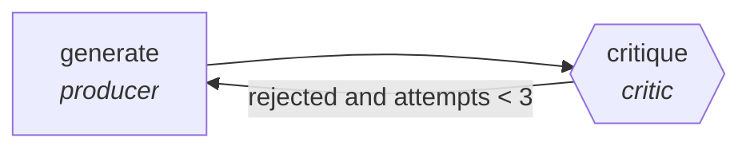

<!-- generated by scripts/gen_cards.py — edit graph.yaml / usecases/catalog.yaml, then `uv run python scripts/gen_cards.py` -->
# 🪪 AGR-018 · `sql-generation-verified`

> Generate SQL, critic checks schema validity and row sanity.

| Card ID | Domain | Pattern | Nodes | Edges | Verifiers | Routers | Max steps | Risk surface |
|---|---|---|---|---|---|---|---|---|
| `AGR-018` | data-analytics | **generator-critic** | 2 | 2 | 1 | 0 | 10 | write |

## The graph



Legend: `[/…/]` router · `{{…}}` verifier · `[…]` worker/agent node.

## What it does

Generate SQL, critic checks schema validity and row sanity.

## Why it should deliver results

The generator optimizes for recall, the critic for precision. Nothing is accepted until the critic signs off, which filters out trivial, tautological, or hallucinated output before it ever reaches you.

- **Exit contract** — query executes; result passes row-count sanity assertions
- **Machine-checked** — `query executes; result passes row-count sanity assertions`
- **Bounded** — hard stop after 10 steps; every loop edge is condition-guarded
- **Gate-checked** — schema + lint + structural gate run in CI; golden eval cases are the next step for this card (see `evals/` for the format)

## How to work with it

```bash
uv run agr show sql-generation-verified       # full definition
uv run agr profile sql-generation-verified    # deterministic structural facts
uv run agr mermaid sql-generation-verified    # regenerate the diagram below
uv run agr adapt sql-generation-verified --target langgraph > app.py   # compile to runnable LangGraph
uv run agr optimize sql-generation-verified   # propose bounded structural improvements (dry-run)
```

Over MCP: `uv run agr mcp` exposes the registry (search / show / profile) to any MCP client.
To evolve it: `uv run agr infuse sql-generation-verified <node> <ability>` — every mutation is gate-checked and appended to the graph's lineage log.

## Node roster

| Node | Speciality | Kind | Abilities |
|---|---|---|---|
| `generate` | producer | agent | generate |
| `critique` | critic | verifier | critique |

## Edge logic

| From | To | Condition |
|---|---|---|
| `generate` | `critique` | always |
| `critique` | `generate` | rejected and attempts < 3 |

## Optional use-cases

Adjacent entries from the use-case catalog this card adapts to with small edits:

- **dashboard-builder** (data-analytics, pipeline) — From metric spec to working dashboard with tested queries. *Verify:* every panel query executes under latency budget.
- **schema-migration-planner** (data-analytics, planner-executor-verifier) — Plan backward-compatible schema changes with shadow reads. *Verify:* shadow-read diff empty before cutover.
- **data-catalog-enrichment** (data-analytics, map-reduce) — Describe every table and column, reduce into a searchable catalog. *Verify:* descriptions exist for all tables; lineage links resolve.
- **capacity-forecaster** (devops-sre, generator-critic) — Forecast load, critic stress-tests assumptions against history. *Verify:* backtest error within stated confidence band.
- **survey-design-critic** (research-knowledge, generator-critic) — Draft survey, critic hunts leading and double-barreled items. *Verify:* zero flagged items remain; branching logic validated.

---
*Regenerate: `uv run python scripts/gen_cards.py` · Index: [CARDS.md](../../../CARDS.md)*
