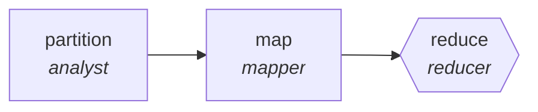

<!-- generated by scripts/gen_cards.py — edit graph.yaml / usecases/catalog.yaml, then `uv run python scripts/gen_cards.py` -->
# 🪪 AGR-013 · `alert-noise-reduction`

> Cluster alerts, dedupe storms, emit one incident per cause.

| Card ID | Domain | Pattern | Nodes | Edges | Verifiers | Routers | Max steps | Risk surface |
|---|---|---|---|---|---|---|---|---|
| `AGR-013` | devops-sre | **map-reduce** | 3 | 2 | 1 | 0 | 20 | write |

## The graph



Legend: `[/…/]` router · `{{…}}` verifier · `[…]` worker/agent node.

## What it does

Cluster alerts, dedupe storms, emit one incident per cause.

## Why it should deliver results

Work fans out over shards and the reduce step merges with explicit dedupe and conflict rules, so throughput scales with shard count while the output stays a single consistent artifact.

- **Exit contract** — dedupe ratio measured; no missed paging alert
- **Machine-checked** — `dedupe ratio measured; no missed paging alert`
- **Bounded** — hard stop after 20 steps; the topology is acyclic
- **Gate-checked** — schema + lint + structural gate run in CI; golden eval cases are the next step for this card (see `evals/` for the format)

## How to work with it

```bash
uv run agr show alert-noise-reduction       # full definition
uv run agr profile alert-noise-reduction    # deterministic structural facts
uv run agr mermaid alert-noise-reduction    # regenerate the diagram below
uv run agr adapt alert-noise-reduction --target langgraph > app.py   # compile to runnable LangGraph
uv run agr optimize alert-noise-reduction   # propose bounded structural improvements (dry-run)
```

Over MCP: `uv run agr mcp` exposes the registry (search / show / profile) to any MCP client.
To evolve it: `uv run agr infuse alert-noise-reduction <node> <ability>` — every mutation is gate-checked and appended to the graph's lineage log.

## Node roster

| Node | Speciality | Kind | Abilities |
|---|---|---|---|
| `partition` | analyst | agent | analyze |
| `map` | mapper | agent | map_shard |
| `reduce` | reducer | verifier | reduce_merge |

## Edge logic

| From | To | Condition |
|---|---|---|
| `partition` | `map` | always |
| `map` | `reduce` | always |

## Optional use-cases

Adjacent entries from the use-case catalog this card adapts to with small edits:

- **cloud-cost-optimizer** (devops-sre, pipeline) — Scan usage, propose rightsizing, verify against SLO headroom. *Verify:* projected savings computed from real billing export.
- **capacity-forecaster** (devops-sre, generator-critic) — Forecast load, critic stress-tests assumptions against history. *Verify:* backtest error within stated confidence band.
- **data-catalog-enrichment** (data-analytics, map-reduce) — Describe every table and column, reduce into a searchable catalog. *Verify:* descriptions exist for all tables; lineage links resolve.
- **patent-landscape** (research-knowledge, map-reduce) — Cluster patents by claim family, summarize white space. *Verify:* cluster assignments reproducible; ids valid.
- **newsletter-assembler** (content-marketing, map-reduce) — Summarize the period's items, reduce into sections. *Verify:* every item links its source; dead links zero.

---
*Regenerate: `uv run python scripts/gen_cards.py` · Index: [CARDS.md](../../../CARDS.md)*
