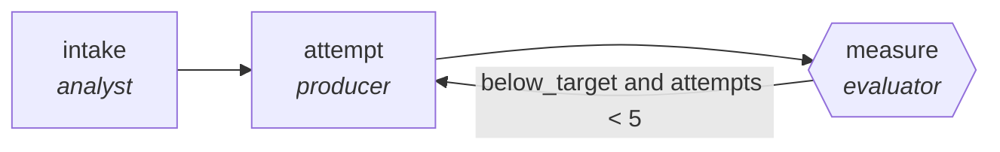

<!-- generated by scripts/gen_cards.py — edit graph.yaml / usecases/catalog.yaml, then `uv run python scripts/gen_cards.py` -->
# 🪪 AGR-015 · `deploy-canary-verifier`

> Progressively shift traffic while checking error budgets.

| Card ID | Domain | Pattern | Nodes | Edges | Verifiers | Routers | Max steps | Risk surface |
|---|---|---|---|---|---|---|---|---|
| `AGR-015` | devops-sre | **loop** | 3 | 3 | 1 | 0 | 15 | write |

## The graph



Legend: `[/…/]` router · `{{…}}` verifier · `[…]` worker/agent node.

## What it does

Progressively shift traffic while checking error budgets.

## Why it should deliver results

A bounded improve-and-measure cycle: each iteration must beat the last measured score or the loop exits. `max_steps` is a hard cap, so the graph can refine but never wander.

- **Exit contract** — rollback fires when error rate exceeds threshold
- **Machine-checked** — `output.error_rate <= output.threshold or output.rollback_fired`
- **Bounded** — hard stop after 15 steps; every loop edge is condition-guarded
- **Golden cases** — `uv run agr eval deploy-canary-verifier` replays recorded cases through the real edge/assert logic (mock runner proves mechanics; `--live` measures your model)
- **Trace gallery** — [every case's route, node outputs, and checked asserts](../../../docs/traces/deploy-canary-verifier.md)

## How to work with it

```bash
uv run agr show deploy-canary-verifier       # full definition
uv run agr profile deploy-canary-verifier    # deterministic structural facts
uv run agr mermaid deploy-canary-verifier    # regenerate the diagram below
uv run agr eval deploy-canary-verifier       # run golden cases (add --live for your endpoint)
uv run agr adapt deploy-canary-verifier --target langgraph > app.py   # compile to runnable LangGraph
uv run agr optimize deploy-canary-verifier   # propose bounded structural improvements (dry-run)
```

Over MCP: `uv run agr mcp` exposes the registry (search / show / profile) to any MCP client.
To evolve it: `uv run agr infuse deploy-canary-verifier <node> <ability>` — every mutation is gate-checked and appended to the graph's lineage log.

## Node roster

| Node | Speciality | Kind | Abilities |
|---|---|---|---|
| `intake` | analyst | agent | analyze |
| `attempt` | producer | agent | generate |
| `measure` | evaluator | verifier | evaluate |

## Edge logic

| From | To | Condition |
|---|---|---|
| `intake` | `attempt` | always |
| `attempt` | `measure` | always |
| `measure` | `attempt` | below_target and attempts < 5 |

## Optional use-cases

Adjacent entries from the use-case catalog this card adapts to with small edits:

- **cloud-cost-optimizer** (devops-sre, pipeline) — Scan usage, propose rightsizing, verify against SLO headroom. *Verify:* projected savings computed from real billing export.
- **capacity-forecaster** (devops-sre, generator-critic) — Forecast load, critic stress-tests assumptions against history. *Verify:* backtest error within stated confidence band.

---
*Regenerate: `uv run python scripts/gen_cards.py` · Index: [CARDS.md](../../../CARDS.md)*
