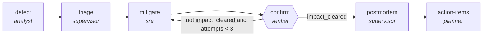

<!-- generated by scripts/gen_cards.py — edit graph.yaml / usecases/catalog.yaml, then `uv run python scripts/gen_cards.py` -->
# 🪪 AGR-116 · `incident-lifecycle`

> Detect, triage, mitigate and prove an incident closed, then write the postmortem and file the actions.

| Card ID | Domain | Pattern | Nodes | Edges | Verifiers | Routers | Max steps | Risk surface |
|---|---|---|---|---|---|---|---|---|
| `AGR-116` | devops-sre | **lifecycle** | 6 | 6 | 1 | 0 | 45 | execute |

> 🎯 **Requires a goal** — the alert to work and what 'resolved' means for this service. Without one the graph refuses and runs no node.

## The graph



Legend: `[/…/]` router · `{{…}}` verifier · `[…]` worker/agent node.

## What it does

Detect, triage, mitigate and prove an incident closed, then write the postmortem and file actions.

## Why it should deliver results

A multi-phase workflow where each phase is itself a motif and hand-offs are explicit. Phases that duplicate an existing single-purpose graph reference it with `kind: subgraph` instead of restating it, so the flat library becomes the component library and a fix to a child propagates to every composite using it.

- **Exit contract** — mitigation is proven effective before the postmortem is written; every postmortem yields owned actions
- **Machine-checked** — `output.impact_cleared == true`
- **Machine-checked** — `len(output.actions) >= 1`
- **Bounded** — hard stop after 45 steps; every loop edge is condition-guarded
- **Golden cases** — `uv run agr eval incident-lifecycle` replays recorded cases through the real edge/assert logic (mock runner proves mechanics; `--live` measures your model)
- **Trace gallery** — [every case's route, node outputs, and checked asserts](../../../docs/traces/incident-lifecycle.md)

## How to work with it

```bash
uv run agr show incident-lifecycle       # full definition
uv run agr profile incident-lifecycle    # deterministic structural facts
uv run agr mermaid incident-lifecycle    # regenerate the diagram below
uv run agr eval incident-lifecycle       # run golden cases (add --live for your endpoint)
uv run agr adapt incident-lifecycle --target langgraph > app.py   # compile to runnable LangGraph
uv run agr optimize incident-lifecycle   # propose bounded structural improvements (dry-run)
```

Over MCP: `uv run agr mcp` exposes the registry (search / show / profile) to any MCP client.
To evolve it: `uv run agr infuse incident-lifecycle <node> <ability>` — every mutation is gate-checked and appended to the graph's lineage log.

## Node roster

| Node | Speciality | Kind | Abilities |
|---|---|---|---|
| `detect` | analyst | agent | analyze |
| `triage` | supervisor | subgraph | — |
| `mitigate` | sre | agent | run_command |
| `confirm` | verifier | verifier | run_command |
| `postmortem` | supervisor | subgraph | — |
| `action-items` | planner | agent | decompose_goal |

## Edge logic

| From | To | Condition |
|---|---|---|
| `detect` | `triage` | always |
| `triage` | `mitigate` | always |
| `mitigate` | `confirm` | always |
| `confirm` | `mitigate` | not impact_cleared and attempts < 3 |
| `confirm` | `postmortem` | impact_cleared |
| `postmortem` | `action-items` | always |

## Optional use-cases

Adjacent entries from the use-case catalog this card adapts to with small edits:

- **cloud-cost-optimizer** (devops-sre, pipeline) — Scan usage, propose rightsizing, verify against SLO headroom. *Verify:* projected savings computed from real billing export.
- **capacity-forecaster** (devops-sre, generator-critic) — Forecast load, critic stress-tests assumptions against history. *Verify:* backtest error within stated confidence band.

---
*Regenerate: `uv run python scripts/gen_cards.py` · Index: [CARDS.md](../../../CARDS.md)*
