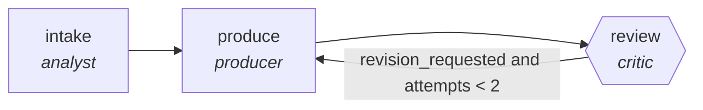

<!-- generated by scripts/gen_cards.py — edit graph.yaml / usecases/catalog.yaml, then `uv run python scripts/gen_cards.py` -->
# 🪪 AGR-016 · `postmortem-writer`

> Assemble timeline from logs and chat, draft blameless postmortem.

| Card ID | Domain | Pattern | Nodes | Edges | Verifiers | Routers | Max steps | Risk surface |
|---|---|---|---|---|---|---|---|---|
| `AGR-016` | devops-sre | **pipeline** | 3 | 3 | 1 | 0 | 12 | write |

> 🎯 **Requires a goal** — the incident timeline to write up and the severity it was declared at. Without one the graph refuses and runs no node.

## The graph



Legend: `[/…/]` router · `{{…}}` verifier · `[…]` worker/agent node.

## What it does

Assemble timeline from logs and chat, draft blameless postmortem.

## Why it should deliver results

Staged specialists each own one narrow concern, so quality problems are localized to the stage that produced them instead of being smeared across a single mega-prompt. Output only leaves the graph through the exit contract.

- **Exit contract** — every timeline event cites a log or message id
- **Machine-checked** — `all(e.get('log_id') or e.get('message_id') for e in output.timeline)`
- **Bounded** — hard stop after 12 steps; every loop edge is condition-guarded
- **Golden cases** — `uv run agr eval postmortem-writer` replays recorded cases through the real edge/assert logic (mock runner proves mechanics; `--live` measures your model)
- **Trace gallery** — [every case's route, node outputs, and checked asserts](../../../docs/traces/postmortem-writer.md)

## How to work with it

```bash
uv run agr show postmortem-writer       # full definition
uv run agr profile postmortem-writer    # deterministic structural facts
uv run agr mermaid postmortem-writer    # regenerate the diagram below
uv run agr eval postmortem-writer       # run golden cases (add --live for your endpoint)
uv run agr adapt postmortem-writer --target langgraph > app.py   # compile to runnable LangGraph
uv run agr optimize postmortem-writer   # propose bounded structural improvements (dry-run)
```

Over MCP: `uv run agr mcp` exposes the registry (search / show / profile) to any MCP client.
To evolve it: `uv run agr infuse postmortem-writer <node> <ability>` — every mutation is gate-checked and appended to the graph's lineage log.

## Node roster

| Node | Speciality | Kind | Abilities |
|---|---|---|---|
| `intake` | analyst | agent | analyze |
| `produce` | producer | agent | generate |
| `review` | critic | verifier | critique |

## Edge logic

| From | To | Condition |
|---|---|---|
| `intake` | `produce` | always |
| `produce` | `review` | always |
| `review` | `produce` | revision_requested and attempts < 2 |

## Optional use-cases

Adjacent entries from the use-case catalog this card adapts to with small edits:

- **cloud-cost-optimizer** (devops-sre, pipeline) — Scan usage, propose rightsizing, verify against SLO headroom. *Verify:* projected savings computed from real billing export.
- **capacity-forecaster** (devops-sre, generator-critic) — Forecast load, critic stress-tests assumptions against history. *Verify:* backtest error within stated confidence band.
- **dashboard-builder** (data-analytics, pipeline) — From metric spec to working dashboard with tested queries. *Verify:* every panel query executes under latency budget.
- **systematic-meta-analysis** (research-knowledge, pipeline) — PRISMA-style screen, extract, pool effect sizes. *Verify:* inclusion log complete; effect sizes recomputable.
- **grant-proposal-pipeline** (research-knowledge, pipeline) — Aims, methods, budget drafted then compliance-checked. *Verify:* funder checklist items all satisfied.

---
*Regenerate: `uv run python scripts/gen_cards.py` · Index: [CARDS.md](../../../CARDS.md)*
