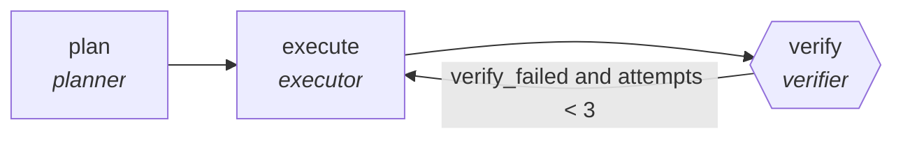

<!-- generated by scripts/gen_cards.py — edit graph.yaml / usecases/catalog.yaml, then `uv run python scripts/gen_cards.py` -->
# 🪪 AGR-012 · `runbook-executor`

> Execute a runbook step-wise with post-condition checks.

| Card ID | Domain | Pattern | Nodes | Edges | Verifiers | Routers | Max steps | Risk surface |
|---|---|---|---|---|---|---|---|---|
| `AGR-012` | devops-sre | **planner-executor-verifier** | 3 | 3 | 1 | 0 | 25 | execute |

## The graph



Legend: `[/…/]` router · `{{…}}` verifier · `[…]` worker/agent node.

## What it does

Execute a runbook step-wise with post-condition checks.

## Why it should deliver results

The plan makes intent inspectable before anything touches the world, the executor works inside that plan, and the verifier proves the postcondition actually holds — success is demonstrated, not asserted.

- **Exit contract** — each step post-condition command exits zero
- **Machine-checked** — `all(s.exit_code == 0 for s in output.steps)`
- **Bounded** — hard stop after 25 steps; every loop edge is condition-guarded
- **Golden cases** — `uv run agr eval runbook-executor` replays recorded cases through the real edge/assert logic (mock runner proves mechanics; `--live` measures your model)
- **Trace gallery** — [every case's route, node outputs, and checked asserts](../../../docs/traces/runbook-executor.md)

## How to work with it

```bash
uv run agr show runbook-executor       # full definition
uv run agr profile runbook-executor    # deterministic structural facts
uv run agr mermaid runbook-executor    # regenerate the diagram below
uv run agr eval runbook-executor       # run golden cases (add --live for your endpoint)
uv run agr adapt runbook-executor --target langgraph > app.py   # compile to runnable LangGraph
uv run agr optimize runbook-executor   # propose bounded structural improvements (dry-run)
```

Over MCP: `uv run agr mcp` exposes the registry (search / show / profile) to any MCP client.
To evolve it: `uv run agr infuse runbook-executor <node> <ability>` — every mutation is gate-checked and appended to the graph's lineage log.

## Node roster

| Node | Speciality | Kind | Abilities |
|---|---|---|---|
| `plan` | planner | agent | decompose_goal |
| `execute` | executor | agent | execute_step |
| `verify` | verifier | verifier | run_command |

## Edge logic

| From | To | Condition |
|---|---|---|
| `plan` | `execute` | always |
| `execute` | `verify` | always |
| `verify` | `execute` | verify_failed and attempts < 3 |

## Optional use-cases

Adjacent entries from the use-case catalog this card adapts to with small edits:

- **cloud-cost-optimizer** (devops-sre, pipeline) — Scan usage, propose rightsizing, verify against SLO headroom. *Verify:* projected savings computed from real billing export.
- **capacity-forecaster** (devops-sre, generator-critic) — Forecast load, critic stress-tests assumptions against history. *Verify:* backtest error within stated confidence band.
- **schema-migration-planner** (data-analytics, planner-executor-verifier) — Plan backward-compatible schema changes with shadow reads. *Verify:* shadow-read diff empty before cutover.
- **social-campaign-planner** (content-marketing, planner-executor-verifier) — Plan a campaign calendar, draft posts, verify constraints. *Verify:* calendar has no channel conflicts; lengths within limits.
- **bioinformatics-pipeline-builder** (healthcare-science, planner-executor-verifier) — Assemble genomics workflow with validated steps. *Verify:* pipeline reproduces reference results on test data.

---
*Regenerate: `uv run python scripts/gen_cards.py` · Index: [CARDS.md](../../../CARDS.md)*
