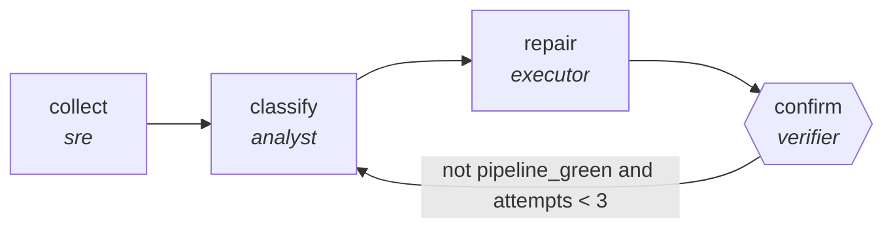

<!-- generated by scripts/gen_cards.py — edit graph.yaml / usecases/catalog.yaml, then `uv run python scripts/gen_cards.py` -->
# 🪪 AGR-129 · `self-healing-ci`

> Diagnose a red pipeline, attempt a bounded repair, and accumulate what did not work across runs.

| Card ID | Domain | Pattern | Nodes | Edges | Verifiers | Routers | Max steps | Risk surface |
|---|---|---|---|---|---|---|---|---|
| `AGR-129` | devops-sre | **reflexion** | 4 | 4 | 1 | 0 | 35 | execute |

## The graph



Legend: `[/…/]` router · `{{…}}` verifier · `[…]` worker/agent node.

## What it does

Diagnose a red pipeline and attempt a bounded repair, accumulating lessons.

## Why it should deliver results

Each failed attempt writes down what was learned, and the next attempt reads it. A plain retry loop re-runs the same reasoning against the same inputs and fails the same way; this one narrows. Lessons are scoped memory, so what the graph learned is inspectable rather than buried in a context window.

- **Exit contract** — a red pipeline ends green or escalated, never retried without a recorded reason
- **Machine-checked** — `output.pipeline_green == true or output.escalated == true`
- **Machine-checked** — `len(output.lessons) >= 1`
- **Bounded** — hard stop after 35 steps; every loop edge is condition-guarded
- **Golden cases** — `uv run agr eval self-healing-ci` replays recorded cases through the real edge/assert logic (mock runner proves mechanics; `--live` measures your model)
- **Trace gallery** — [every case's route, node outputs, and checked asserts](../../../docs/traces/self-healing-ci.md)

## How to work with it

```bash
uv run agr show self-healing-ci       # full definition
uv run agr profile self-healing-ci    # deterministic structural facts
uv run agr mermaid self-healing-ci    # regenerate the diagram below
uv run agr eval self-healing-ci       # run golden cases (add --live for your endpoint)
uv run agr adapt self-healing-ci --target langgraph > app.py   # compile to runnable LangGraph
uv run agr optimize self-healing-ci   # propose bounded structural improvements (dry-run)
```

Over MCP: `uv run agr mcp` exposes the registry (search / show / profile) to any MCP client.
To evolve it: `uv run agr infuse self-healing-ci <node> <ability>` — every mutation is gate-checked and appended to the graph's lineage log.

## Node roster

| Node | Speciality | Kind | Abilities |
|---|---|---|---|
| `collect` | sre | agent | run_command |
| `classify` | analyst | agent | analyze |
| `repair` | executor | agent | execute_step |
| `confirm` | verifier | verifier | run_command |

## Edge logic

| From | To | Condition |
|---|---|---|
| `collect` | `classify` | always |
| `classify` | `repair` | always |
| `repair` | `confirm` | always |
| `confirm` | `classify` | not pipeline_green and attempts < 3 |

## Optional use-cases

Adjacent entries from the use-case catalog this card adapts to with small edits:

- **cloud-cost-optimizer** (devops-sre, pipeline) — Scan usage, propose rightsizing, verify against SLO headroom. *Verify:* projected savings computed from real billing export.
- **capacity-forecaster** (devops-sre, generator-critic) — Forecast load, critic stress-tests assumptions against history. *Verify:* backtest error within stated confidence band.

---
*Regenerate: `uv run python scripts/gen_cards.py` · Index: [CARDS.md](../../../CARDS.md)*
