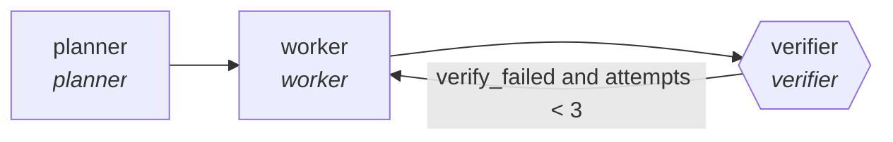

<!-- generated by scripts/gen_cards.py — edit graph.yaml / usecases/catalog.yaml, then `uv run python scripts/gen_cards.py` -->
# 🪪 AGR-114 · `verifier-swarm`

> Planner fans work out to isolated workers; nothing merges until a verifier command proves the goal is done.

| Card ID | Domain | Pattern | Nodes | Edges | Verifiers | Routers | Max steps | Risk surface |
|---|---|---|---|---|---|---|---|---|
| `AGR-114` | devops-sre | **parallel-swarm** | 3 | 3 | 1 | 0 | 30 | execute |

## The graph



Legend: `[/…/]` router · `{{…}}` verifier · `[…]` worker/agent node.

## What it does

Independent verifiers check an artifact in parallel; disagreement blocks release.

## Why it should deliver results

Independent workers cover disjoint slices of the input at the same time. Because they cannot see each other's drafts, agreement is evidence and disagreement surfaces blind spots; the aggregator merges with explicit rules. Wall-clock time is roughly the slowest worker, not the sum.

- **Exit contract** — verifier command exits 0, or 3 failed attempts escalate to human
- **Machine-checked** — `output.verified == true or output.escalated == true`
- **Command-checked** — `user-supplied verify command must exit 0`
- **Bounded** — hard stop after 30 steps; every loop edge is condition-guarded
- **Golden cases** — `uv run agr eval verifier-swarm` replays recorded cases through the real edge/assert logic (mock runner proves mechanics; `--live` measures your model)

## How to work with it

```bash
uv run agr show verifier-swarm       # full definition
uv run agr profile verifier-swarm    # deterministic structural facts
uv run agr mermaid verifier-swarm    # regenerate the diagram below
uv run agr eval verifier-swarm       # run golden cases (add --live for your endpoint)
uv run agr adapt verifier-swarm --target langgraph > app.py   # compile to runnable LangGraph
uv run agr optimize verifier-swarm   # propose bounded structural improvements (dry-run)
```

Over MCP: `uv run agr mcp` exposes the registry (search / show / profile) to any MCP client.
To evolve it: `uv run agr infuse verifier-swarm <node> <ability>` — every mutation is gate-checked and appended to the graph's lineage log.

## Node roster

| Node | Speciality | Kind | Abilities |
|---|---|---|---|
| `planner` | planner | agent | decompose_goal |
| `worker` | worker | agent | run_command, edit_files |
| `verifier` | verifier | verifier | run_command |

## Edge logic

| From | To | Condition |
|---|---|---|
| `planner` | `worker` | always |
| `worker` | `verifier` | always |
| `verifier` | `worker` | verify_failed and attempts < 3 |

## Optional use-cases

Adjacent entries from the use-case catalog this card adapts to with small edits:

- **cloud-cost-optimizer** (devops-sre, pipeline) — Scan usage, propose rightsizing, verify against SLO headroom. *Verify:* projected savings computed from real billing export.
- **capacity-forecaster** (devops-sre, generator-critic) — Forecast load, critic stress-tests assumptions against history. *Verify:* backtest error within stated confidence band.
- **brand-consistency-audit** (content-marketing, parallel-swarm) — Workers audit assets against voice and visual guidelines. *Verify:* violations reported per asset with rule ids.
- **vendor-comparison-matrix** (business-ops, parallel-swarm) — Workers score vendors per criterion from evidence. *Verify:* every score cites vendor documentation.
- **regulatory-filing-check** (finance, parallel-swarm) — Workers check filing sections against requirement checklists. *Verify:* every checklist item pass or fail with location.

---
*Regenerate: `uv run python scripts/gen_cards.py` · Index: [CARDS.md](../../../CARDS.md)*
