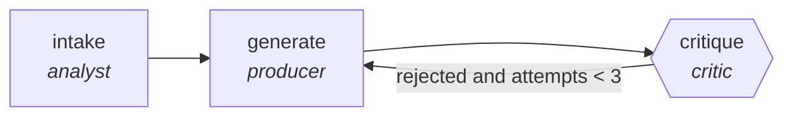

<!-- generated by scripts/gen_cards.py — edit graph.yaml / usecases/catalog.yaml, then `uv run python scripts/gen_cards.py` -->
# 🪪 AGR-072 · `essay-feedback-critic`

> Rubric-based feedback with evidence quotes from the essay.

| Card ID | Domain | Pattern | Nodes | Edges | Verifiers | Routers | Max steps | Risk surface |
|---|---|---|---|---|---|---|---|---|
| `AGR-072` | education | **generator-critic** | 3 | 3 | 1 | 0 | 10 | write |

## The graph



Legend: `[/…/]` router · `{{…}}` verifier · `[…]` worker/agent node.

## What it does

Rubric-based feedback with evidence quotes from the essay.

## Why it should deliver results

The generator optimizes for recall, the critic for precision. Nothing is accepted until the critic signs off, which filters out trivial, tautological, or hallucinated output before it ever reaches you.

- **Exit contract** — every comment quotes essay text; rubric ids cited
- **Machine-checked** — `all(c.quote and c.rubric_id for c in output.comments)`
- **Bounded** — hard stop after 10 steps; every loop edge is condition-guarded
- **Golden cases** — `uv run agr eval essay-feedback-critic` replays recorded cases through the real edge/assert logic (mock runner proves mechanics; `--live` measures your model)
- **Trace gallery** — [every case's route, node outputs, and checked asserts](../../../docs/traces/essay-feedback-critic.md)

## How to work with it

```bash
uv run agr show essay-feedback-critic       # full definition
uv run agr profile essay-feedback-critic    # deterministic structural facts
uv run agr mermaid essay-feedback-critic    # regenerate the diagram below
uv run agr eval essay-feedback-critic       # run golden cases (add --live for your endpoint)
uv run agr adapt essay-feedback-critic --target langgraph > app.py   # compile to runnable LangGraph
uv run agr optimize essay-feedback-critic   # propose bounded structural improvements (dry-run)
```

Over MCP: `uv run agr mcp` exposes the registry (search / show / profile) to any MCP client.
To evolve it: `uv run agr infuse essay-feedback-critic <node> <ability>` — every mutation is gate-checked and appended to the graph's lineage log.

## Node roster

| Node | Speciality | Kind | Abilities |
|---|---|---|---|
| `intake` | analyst | agent | analyze |
| `generate` | producer | agent | generate |
| `critique` | critic | verifier | critique |

## Edge logic

| From | To | Condition |
|---|---|---|
| `intake` | `generate` | always |
| `generate` | `critique` | always |
| `critique` | `generate` | rejected and attempts < 3 |

## Optional use-cases

Adjacent entries from the use-case catalog this card adapts to with small edits:

- **curriculum-designer** (education, planner-executor-verifier) — Design course from outcomes to assessments with alignment. *Verify:* every outcome mapped to lesson and assessment.
- **tutoring-router** (education, router) — Route learner questions by topic and difficulty to tutors. *Verify:* routing matches topic taxonomy on holdout set.
- **learning-path-planner** (education, planner-executor-verifier) — Sequence modules against prerequisites and pace. *Verify:* prerequisite DAG has no violations.
- **course-localization** (education, map-reduce) — Localize materials per language, reduce into a QA report. *Verify:* terminology glossary respected; media links valid.
- **capacity-forecaster** (devops-sre, generator-critic) — Forecast load, critic stress-tests assumptions against history. *Verify:* backtest error within stated confidence band.

---
*Regenerate: `uv run python scripts/gen_cards.py` · Index: [CARDS.md](../../../CARDS.md)*
