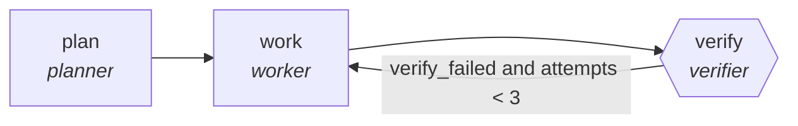

<!-- generated by scripts/gen_cards.py — edit graph.yaml / usecases/catalog.yaml, then `uv run python scripts/gen_cards.py` -->
# 🪪 AGR-075 · `rubric-grading-swarm`

> Independent graders score, disagreements auto-escalate.

| Card ID | Domain | Pattern | Nodes | Edges | Verifiers | Routers | Max steps | Risk surface |
|---|---|---|---|---|---|---|---|---|
| `AGR-075` | education | **parallel-swarm** | 3 | 3 | 1 | 0 | 30 | execute |

## The graph



Legend: `[/…/]` router · `{{…}}` verifier · `[…]` worker/agent node.

## What it does

Independent graders score, disagreements auto-escalate.

## Why it should deliver results

Independent workers cover disjoint slices of the input at the same time. Because they cannot see each other's drafts, agreement is evidence and disagreement surfaces blind spots; the aggregator merges with explicit rules. Wall-clock time is roughly the slowest worker, not the sum.

- **Exit contract** — inter-rater agreement above threshold or escalated
- **Machine-checked** — `inter-rater agreement above threshold or escalated`
- **Bounded** — hard stop after 30 steps; every loop edge is condition-guarded
- **Gate-checked** — schema + lint + structural gate run in CI; golden eval cases are the next step for this card (see `evals/` for the format)

## How to work with it

```bash
uv run agr show rubric-grading-swarm       # full definition
uv run agr profile rubric-grading-swarm    # deterministic structural facts
uv run agr mermaid rubric-grading-swarm    # regenerate the diagram below
uv run agr adapt rubric-grading-swarm --target langgraph > app.py   # compile to runnable LangGraph
uv run agr optimize rubric-grading-swarm   # propose bounded structural improvements (dry-run)
```

Over MCP: `uv run agr mcp` exposes the registry (search / show / profile) to any MCP client.
To evolve it: `uv run agr infuse rubric-grading-swarm <node> <ability>` — every mutation is gate-checked and appended to the graph's lineage log.

## Node roster

| Node | Speciality | Kind | Abilities |
|---|---|---|---|
| `plan` | planner | agent | decompose_goal |
| `work` | worker | agent | run_command, edit_files |
| `verify` | verifier | verifier | run_command |

## Edge logic

| From | To | Condition |
|---|---|---|
| `plan` | `work` | always |
| `work` | `verify` | always |
| `verify` | `work` | verify_failed and attempts < 3 |

## Optional use-cases

Adjacent entries from the use-case catalog this card adapts to with small edits:

- **curriculum-designer** (education, planner-executor-verifier) — Design course from outcomes to assessments with alignment. *Verify:* every outcome mapped to lesson and assessment.
- **tutoring-router** (education, router) — Route learner questions by topic and difficulty to tutors. *Verify:* routing matches topic taxonomy on holdout set.
- **learning-path-planner** (education, planner-executor-verifier) — Sequence modules against prerequisites and pace. *Verify:* prerequisite DAG has no violations.
- **course-localization** (education, map-reduce) — Localize materials per language, reduce into a QA report. *Verify:* terminology glossary respected; media links valid.
- **brand-consistency-audit** (content-marketing, parallel-swarm) — Workers audit assets against voice and visual guidelines. *Verify:* violations reported per asset with rule ids.

---
*Regenerate: `uv run python scripts/gen_cards.py` · Index: [CARDS.md](../../../CARDS.md)*
