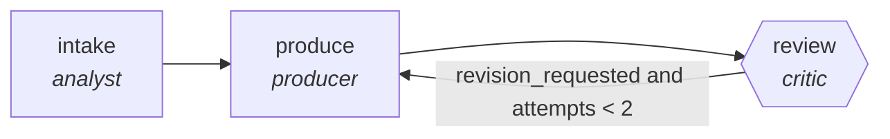

<!-- generated by scripts/gen_cards.py — edit graph.yaml / usecases/catalog.yaml, then `uv run python scripts/gen_cards.py` -->
# 🪪 AGR-052 · `kyc-document-processing`

> Extract, cross-check, and flag gaps in KYC documents.

| Card ID | Domain | Pattern | Nodes | Edges | Verifiers | Routers | Max steps | Risk surface |
|---|---|---|---|---|---|---|---|---|
| `AGR-052` | finance | **pipeline** | 3 | 3 | 1 | 0 | 12 | write |

## The graph



Legend: `[/…/]` router · `{{…}}` verifier · `[…]` worker/agent node.

## What it does

Extract, cross-check, and flag gaps in KYC documents.

## Why it should deliver results

Staged specialists each own one narrow concern, so quality problems are localized to the stage that produced them instead of being smeared across a single mega-prompt. Output only leaves the graph through the exit contract.

- **Exit contract** — extracted fields validate against document images
- **Machine-checked** — `extracted fields validate against document images`
- **Bounded** — hard stop after 12 steps; every loop edge is condition-guarded
- **Gate-checked** — schema + lint + structural gate run in CI; golden eval cases are the next step for this card (see `evals/` for the format)

## How to work with it

```bash
uv run agr show kyc-document-processing       # full definition
uv run agr profile kyc-document-processing    # deterministic structural facts
uv run agr mermaid kyc-document-processing    # regenerate the diagram below
uv run agr adapt kyc-document-processing --target langgraph > app.py   # compile to runnable LangGraph
uv run agr optimize kyc-document-processing   # propose bounded structural improvements (dry-run)
```

Over MCP: `uv run agr mcp` exposes the registry (search / show / profile) to any MCP client.
To evolve it: `uv run agr infuse kyc-document-processing <node> <ability>` — every mutation is gate-checked and appended to the graph's lineage log.

## Node roster

| Node | Speciality | Kind | Abilities |
|---|---|---|---|
| `intake` | analyst | agent | analyze |
| `produce` | producer | agent | generate |
| `review` | critic | verifier | critique |

## Edge logic

| From | To | Condition |
|---|---|---|
| `intake` | `produce` | always |
| `produce` | `review` | always |
| `review` | `produce` | revision_requested and attempts < 2 |

## Optional use-cases

Adjacent entries from the use-case catalog this card adapts to with small edits:

- **budget-variance-analysis** (finance, map-reduce) — Explain variance per cost center, reduce to an exec brief. *Verify:* variances sum to total; drivers cite ledger lines.
- **fraud-pattern-triage** (finance, router) — Route flagged transactions to rule, anomaly, or manual review. *Verify:* routing precision measured against labeled history.
- **regulatory-filing-check** (finance, parallel-swarm) — Workers check filing sections against requirement checklists. *Verify:* every checklist item pass or fail with location.
- **portfolio-report-generation** (finance, pipeline) — Assemble informational holdings and performance reporting. *Verify:* figures reconcile to custodian data; no advice emitted.
- **cloud-cost-optimizer** (devops-sre, pipeline) — Scan usage, propose rightsizing, verify against SLO headroom. *Verify:* projected savings computed from real billing export.

---
*Regenerate: `uv run python scripts/gen_cards.py` · Index: [CARDS.md](../../../CARDS.md)*
