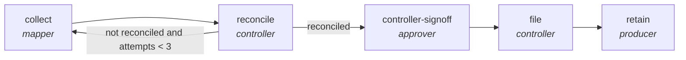

<!-- generated by scripts/gen_cards.py — edit graph.yaml / usecases/catalog.yaml, then `uv run python scripts/gen_cards.py` -->
# 🪪 AGR-121 · `regulatory-filing-lifecycle`

> Collect figures, reconcile them to source, gate on controller sign-off, then file and retain evidence.

| Card ID | Domain | Pattern | Nodes | Edges | Verifiers | Routers | Max steps | Risk surface |
|---|---|---|---|---|---|---|---|---|
| `AGR-121` | finance | **human-gate** | 5 | 5 | 0 | 0 | 35 | execute |

> 🎯 **Requires a goal** — the filing period and the regime being filed under. Without one the graph refuses and runs no node.

## The graph



Legend: `[/…/]` router · `{{…}}` verifier · `[…]` worker/agent node.

## What it does

Collect, reconcile, sign off, file and retain evidence for a regulatory filing.

## Why it should deliver results

A `kind: human` node holds an approval contract that no model may sign — the live runner raises rather than approve its own work. Downstream flow edges stay blocked until the contract evaluates true, which is what makes a graph usable in a regulated domain instead of merely plausible-looking.

- **Exit contract** — nothing files until figures reconcile to source and a controller signs
- **Machine-checked** — `output.reconciled == true`
- **Machine-checked** — `output.signed_off == true`
- **Machine-checked** — `output.filed == true and output.evidence_pack is not None`
- **Bounded** — hard stop after 35 steps; every loop edge is condition-guarded
- **Golden cases** — `uv run agr eval regulatory-filing-lifecycle` replays recorded cases through the real edge/assert logic (mock runner proves mechanics; `--live` measures your model)
- **Trace gallery** — [every case's route, node outputs, and checked asserts](../../../docs/traces/regulatory-filing-lifecycle.md)

## How to work with it

```bash
uv run agr show regulatory-filing-lifecycle       # full definition
uv run agr profile regulatory-filing-lifecycle    # deterministic structural facts
uv run agr mermaid regulatory-filing-lifecycle    # regenerate the diagram below
uv run agr eval regulatory-filing-lifecycle       # run golden cases (add --live for your endpoint)
uv run agr adapt regulatory-filing-lifecycle --target langgraph > app.py   # compile to runnable LangGraph
uv run agr optimize regulatory-filing-lifecycle   # propose bounded structural improvements (dry-run)
```

Over MCP: `uv run agr mcp` exposes the registry (search / show / profile) to any MCP client.
To evolve it: `uv run agr infuse regulatory-filing-lifecycle <node> <ability>` — every mutation is gate-checked and appended to the graph's lineage log.

## Node roster

| Node | Speciality | Kind | Abilities |
|---|---|---|---|
| `collect` | mapper | agent | map_shard |
| `reconcile` | controller | agent | analyze |
| `controller-signoff` | approver | human | approve |
| `file` | controller | agent | analyze, file_record |
| `retain` | producer | agent | generate |

## Edge logic

| From | To | Condition |
|---|---|---|
| `collect` | `reconcile` | always |
| `reconcile` | `collect` | not reconciled and attempts < 3 |
| `reconcile` | `controller-signoff` | reconciled |
| `controller-signoff` | `file` | always |
| `file` | `retain` | always |

## Optional use-cases

Adjacent entries from the use-case catalog this card adapts to with small edits:

- **budget-variance-analysis** (finance, map-reduce) — Explain variance per cost center, reduce to an exec brief. *Verify:* variances sum to total; drivers cite ledger lines.
- **fraud-pattern-triage** (finance, router) — Route flagged transactions to rule, anomaly, or manual review. *Verify:* routing precision measured against labeled history.
- **regulatory-filing-check** (finance, parallel-swarm) — Workers check filing sections against requirement checklists. *Verify:* every checklist item pass or fail with location.
- **portfolio-report-generation** (finance, pipeline) — Assemble informational holdings and performance reporting. *Verify:* figures reconcile to custodian data; no advice emitted.

---
*Regenerate: `uv run python scripts/gen_cards.py` · Index: [CARDS.md](../../../CARDS.md)*
