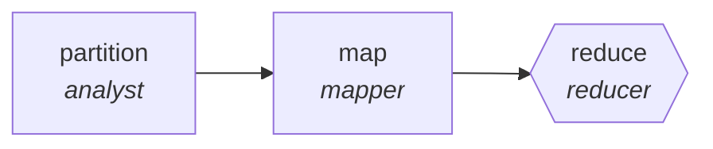

<!-- generated by scripts/gen_cards.py — edit graph.yaml / usecases/catalog.yaml, then `uv run python scripts/gen_cards.py` -->
# 🪪 AGR-067 · `adverse-event-scanner`

> Scan reports for adverse-event signals, reduce to summary.

| Card ID | Domain | Pattern | Nodes | Edges | Verifiers | Routers | Max steps | Risk surface |
|---|---|---|---|---|---|---|---|---|
| `AGR-067` | healthcare-science | **map-reduce** | 3 | 2 | 1 | 0 | 20 | write |

> 🎯 **Requires a goal** — the reports to scan and the product whose safety signal matters. Without one the graph refuses and runs no node.

## The graph



Legend: `[/…/]` router · `{{…}}` verifier · `[…]` worker/agent node.

## What it does

Scan reports for adverse-event signals, reduce to summary.

## Why it should deliver results

Work fans out over shards and the reduce step merges with explicit dedupe and conflict rules, so throughput scales with shard count while the output stays a single consistent artifact.

- **Exit contract** — every signal cites report ids; counts reproducible
- **Machine-checked** — `all(s.report_ids and s.report_ids[s.count - 1:] and not s.report_ids[s.count:] for s in output.signals)`
- **Bounded** — hard stop after 20 steps; the topology is acyclic
- **Golden cases** — `uv run agr eval adverse-event-scanner` replays recorded cases through the real edge/assert logic (mock runner proves mechanics; `--live` measures your model)
- **Trace gallery** — [every case's route, node outputs, and checked asserts](../../../docs/traces/adverse-event-scanner.md)

## How to work with it

```bash
uv run agr show adverse-event-scanner       # full definition
uv run agr profile adverse-event-scanner    # deterministic structural facts
uv run agr mermaid adverse-event-scanner    # regenerate the diagram below
uv run agr eval adverse-event-scanner       # run golden cases (add --live for your endpoint)
uv run agr adapt adverse-event-scanner --target langgraph > app.py   # compile to runnable LangGraph
uv run agr optimize adverse-event-scanner   # propose bounded structural improvements (dry-run)
```

Over MCP: `uv run agr mcp` exposes the registry (search / show / profile) to any MCP client.
To evolve it: `uv run agr infuse adverse-event-scanner <node> <ability>` — every mutation is gate-checked and appended to the graph's lineage log.

## Node roster

| Node | Speciality | Kind | Abilities |
|---|---|---|---|
| `partition` | analyst | agent | analyze |
| `map` | mapper | agent | map_shard |
| `reduce` | reducer | verifier | reduce_merge |

## Edge logic

| From | To | Condition |
|---|---|---|
| `partition` | `map` | always |
| `map` | `reduce` | always |

## Optional use-cases

Adjacent entries from the use-case catalog this card adapts to with small edits:

- **protocol-drafting-critic** (healthcare-science, generator-critic) — Draft study protocols, critic checks power and ethics gaps. *Verify:* checklist conformance complete; power calc reproducible.
- **bioinformatics-pipeline-builder** (healthcare-science, planner-executor-verifier) — Assemble genomics workflow with validated steps. *Verify:* pipeline reproduces reference results on test data.
- **lab-notebook-summarizer** (healthcare-science, pipeline) — Turn raw notebook entries into structured experiment records. *Verify:* records validate against schema; entries linked.
- **data-catalog-enrichment** (data-analytics, map-reduce) — Describe every table and column, reduce into a searchable catalog. *Verify:* descriptions exist for all tables; lineage links resolve.
- **patent-landscape** (research-knowledge, map-reduce) — Cluster patents by claim family, summarize white space. *Verify:* cluster assignments reproducible; ids valid.

---
*Regenerate: `uv run python scripts/gen_cards.py` · Index: [CARDS.md](../../../CARDS.md)*
