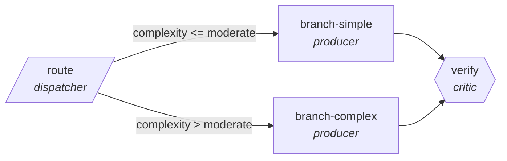

<!-- generated by scripts/gen_cards.py — edit graph.yaml / usecases/catalog.yaml, then `uv run python scripts/gen_cards.py` -->
# 🪪 AGR-063 · `clinical-literature-triage`

> Route new papers by study type and evidence level.

| Card ID | Domain | Pattern | Nodes | Edges | Verifiers | Routers | Max steps | Risk surface |
|---|---|---|---|---|---|---|---|---|
| `AGR-063` | healthcare-science | **router** | 4 | 4 | 1 | 1 | 12 | write |

## The graph



Legend: `[/…/]` router · `{{…}}` verifier · `[…]` worker/agent node.

## What it does

Route new papers by study type and evidence level.

## Why it should deliver results

A cheap classifier sends every item down the narrowest branch that can handle it, so cost and latency scale with the difficulty of each item rather than the worst case. Escalation edges guarantee hard items still reach the strong path.

- **Exit contract** — labels match a validated sample set
- **Machine-checked** — `labels match a validated sample set`
- **Bounded** — hard stop after 12 steps; the topology is acyclic
- **Gate-checked** — schema + lint + structural gate run in CI; golden eval cases are the next step for this card (see `evals/` for the format)

## How to work with it

```bash
uv run agr show clinical-literature-triage       # full definition
uv run agr profile clinical-literature-triage    # deterministic structural facts
uv run agr mermaid clinical-literature-triage    # regenerate the diagram below
uv run agr adapt clinical-literature-triage --target langgraph > app.py   # compile to runnable LangGraph
uv run agr optimize clinical-literature-triage   # propose bounded structural improvements (dry-run)
```

Over MCP: `uv run agr mcp` exposes the registry (search / show / profile) to any MCP client.
To evolve it: `uv run agr infuse clinical-literature-triage <node> <ability>` — every mutation is gate-checked and appended to the graph's lineage log.

## Node roster

| Node | Speciality | Kind | Abilities |
|---|---|---|---|
| `route` | dispatcher | router | dispatch |
| `branch-simple` | producer | agent | generate |
| `branch-complex` | producer | agent | generate |
| `verify` | critic | verifier | critique |

## Edge logic

| From | To | Condition |
|---|---|---|
| `route` | `branch-simple` | complexity <= moderate |
| `route` | `branch-complex` | complexity > moderate |
| `branch-simple` | `verify` | always |
| `branch-complex` | `verify` | always |

## Optional use-cases

Adjacent entries from the use-case catalog this card adapts to with small edits:

- **protocol-drafting-critic** (healthcare-science, generator-critic) — Draft study protocols, critic checks power and ethics gaps. *Verify:* checklist conformance complete; power calc reproducible.
- **bioinformatics-pipeline-builder** (healthcare-science, planner-executor-verifier) — Assemble genomics workflow with validated steps. *Verify:* pipeline reproduces reference results on test data.
- **lab-notebook-summarizer** (healthcare-science, pipeline) — Turn raw notebook entries into structured experiment records. *Verify:* records validate against schema; entries linked.
- **trial-eligibility-screener** (healthcare-science, pipeline) — Screen criteria against records for informational matching. *Verify:* each criterion pass or fail with evidence span.
- **invoice-reconciliation** (business-ops, router) — Match invoices to POs, route exceptions by mismatch type. *Verify:* matched set balances; exceptions carry mismatch reason.

---
*Regenerate: `uv run python scripts/gen_cards.py` · Index: [CARDS.md](../../../CARDS.md)*
