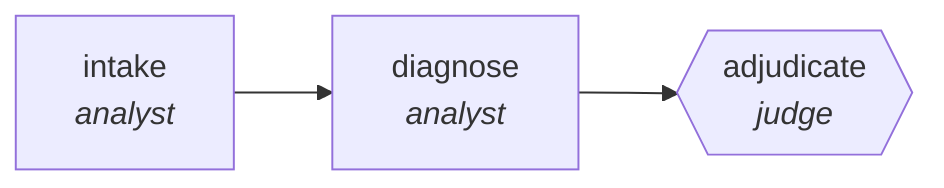

<!-- generated by scripts/gen_cards.py — edit graph.yaml / usecases/catalog.yaml, then `uv run python scripts/gen_cards.py` -->
# 🪪 AGR-126 · `differential-diagnosis-ensemble`

> Independent diagnosticians rank hypotheses; a quorum decides and dissent is reported, never dropped.

| Card ID | Domain | Pattern | Nodes | Edges | Verifiers | Routers | Max steps | Risk surface |
|---|---|---|---|---|---|---|---|---|
| `AGR-126` | healthcare-science | **ensemble-quorum** | 3 | 2 | 1 | 0 | 30 | read |

> 🎯 **Requires a goal** — the case to work up and the question the clinician needs answered. Without one the graph refuses and runs no node.

## The graph



Legend: `[/…/]` router · `{{…}}` verifier · `[…]` worker/agent node.

## What it does

Independent diagnosticians rank hypotheses; a quorum decides, dissent is reported.

## Why it should deliver results

Several independent passes answer the same question and a quorum decides. Because the passes cannot see each other, agreement is evidence and spread is a calibration signal. Dissent is reported alongside the verdict rather than averaged away, and a tie is surfaced as no-consensus instead of resolved by coin flip.

- **Exit contract** — a diagnosis carries its quorum; disagreement is reported rather than averaged away
- **Machine-checked** — `output.consensus is not None or len(output.dissent) > 0`
- **Machine-checked** — `output.dissent_retained == true`
- **Bounded** — hard stop after 30 steps; the topology is acyclic
- **Golden cases** — `uv run agr eval differential-diagnosis-ensemble` replays recorded cases through the real edge/assert logic (mock runner proves mechanics; `--live` measures your model)
- **Trace gallery** — [every case's route, node outputs, and checked asserts](../../../docs/traces/differential-diagnosis-ensemble.md)

## How to work with it

```bash
uv run agr show differential-diagnosis-ensemble       # full definition
uv run agr profile differential-diagnosis-ensemble    # deterministic structural facts
uv run agr mermaid differential-diagnosis-ensemble    # regenerate the diagram below
uv run agr eval differential-diagnosis-ensemble       # run golden cases (add --live for your endpoint)
uv run agr adapt differential-diagnosis-ensemble --target langgraph > app.py   # compile to runnable LangGraph
uv run agr optimize differential-diagnosis-ensemble   # propose bounded structural improvements (dry-run)
```

Over MCP: `uv run agr mcp` exposes the registry (search / show / profile) to any MCP client.
To evolve it: `uv run agr infuse differential-diagnosis-ensemble <node> <ability>` — every mutation is gate-checked and appended to the graph's lineage log.

## Node roster

| Node | Speciality | Kind | Abilities |
|---|---|---|---|
| `intake` | analyst | agent | analyze |
| `diagnose` | analyst | agent | analyze |
| `adjudicate` | judge | verifier | adjudicate |

## Edge logic

| From | To | Condition |
|---|---|---|
| `intake` | `diagnose` | always |
| `diagnose` | `adjudicate` | always |

## Optional use-cases

Adjacent entries from the use-case catalog this card adapts to with small edits:

- **protocol-drafting-critic** (healthcare-science, generator-critic) — Draft study protocols, critic checks power and ethics gaps. *Verify:* checklist conformance complete; power calc reproducible.
- **bioinformatics-pipeline-builder** (healthcare-science, planner-executor-verifier) — Assemble genomics workflow with validated steps. *Verify:* pipeline reproduces reference results on test data.
- **lab-notebook-summarizer** (healthcare-science, pipeline) — Turn raw notebook entries into structured experiment records. *Verify:* records validate against schema; entries linked.

---
*Regenerate: `uv run python scripts/gen_cards.py` · Index: [CARDS.md](../../../CARDS.md)*
