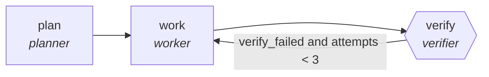

<!-- generated by scripts/gen_cards.py — edit graph.yaml / usecases/catalog.yaml, then `uv run python scripts/gen_cards.py` -->
# 🪪 AGR-065 · `medical-coding-audit`

> Workers verify diagnosis and procedure codes against notes.

| Card ID | Domain | Pattern | Nodes | Edges | Verifiers | Routers | Max steps | Risk surface |
|---|---|---|---|---|---|---|---|---|
| `AGR-065` | healthcare-science | **parallel-swarm** | 3 | 3 | 1 | 0 | 30 | execute |

## The graph



Legend: `[/…/]` router · `{{…}}` verifier · `[…]` worker/agent node.

## What it does

Workers verify diagnosis and procedure codes against notes.

## Why it should deliver results

Independent workers cover disjoint slices of the input at the same time. Because they cannot see each other's drafts, agreement is evidence and disagreement surfaces blind spots; the aggregator merges with explicit rules. Wall-clock time is roughly the slowest worker, not the sum.

- **Exit contract** — code assignments justified by note spans
- **Machine-checked** — `all(c.note_span for c in output.codes)`
- **Bounded** — hard stop after 30 steps; every loop edge is condition-guarded
- **Golden cases** — `uv run agr eval medical-coding-audit` replays recorded cases through the real edge/assert logic (mock runner proves mechanics; `--live` measures your model)
- **Trace gallery** — [every case's route, node outputs, and checked asserts](../../../docs/traces/medical-coding-audit.md)

## How to work with it

```bash
uv run agr show medical-coding-audit       # full definition
uv run agr profile medical-coding-audit    # deterministic structural facts
uv run agr mermaid medical-coding-audit    # regenerate the diagram below
uv run agr eval medical-coding-audit       # run golden cases (add --live for your endpoint)
uv run agr adapt medical-coding-audit --target langgraph > app.py   # compile to runnable LangGraph
uv run agr optimize medical-coding-audit   # propose bounded structural improvements (dry-run)
```

Over MCP: `uv run agr mcp` exposes the registry (search / show / profile) to any MCP client.
To evolve it: `uv run agr infuse medical-coding-audit <node> <ability>` — every mutation is gate-checked and appended to the graph's lineage log.

## Node roster

| Node | Speciality | Kind | Abilities |
|---|---|---|---|
| `plan` | planner | agent | decompose_goal |
| `work` | worker | agent | run_command, edit_files |
| `verify` | verifier | verifier | run_command |

## Edge logic

| From | To | Condition |
|---|---|---|
| `plan` | `work` | always |
| `work` | `verify` | always |
| `verify` | `work` | verify_failed and attempts < 3 |

## Optional use-cases

Adjacent entries from the use-case catalog this card adapts to with small edits:

- **protocol-drafting-critic** (healthcare-science, generator-critic) — Draft study protocols, critic checks power and ethics gaps. *Verify:* checklist conformance complete; power calc reproducible.
- **bioinformatics-pipeline-builder** (healthcare-science, planner-executor-verifier) — Assemble genomics workflow with validated steps. *Verify:* pipeline reproduces reference results on test data.
- **lab-notebook-summarizer** (healthcare-science, pipeline) — Turn raw notebook entries into structured experiment records. *Verify:* records validate against schema; entries linked.
- **brand-consistency-audit** (content-marketing, parallel-swarm) — Workers audit assets against voice and visual guidelines. *Verify:* violations reported per asset with rule ids.
- **regulatory-filing-check** (finance, parallel-swarm) — Workers check filing sections against requirement checklists. *Verify:* every checklist item pass or fail with location.

---
*Regenerate: `uv run python scripts/gen_cards.py` · Index: [CARDS.md](../../../CARDS.md)*
