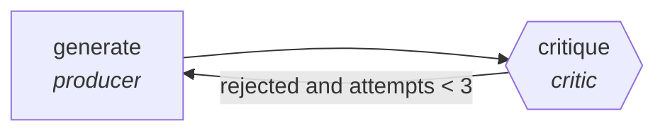

<!-- generated by scripts/gen_cards.py — edit graph.yaml / usecases/catalog.yaml, then `uv run python scripts/gen_cards.py` -->
# 🪪 AGR-091 · `jd-drafting-critic`

> Draft job descriptions, critic removes bias and inflation.

| Card ID | Domain | Pattern | Nodes | Edges | Verifiers | Routers | Max steps | Risk surface |
|---|---|---|---|---|---|---|---|---|
| `AGR-091` | hr-people | **generator-critic** | 2 | 2 | 1 | 0 | 10 | write |

## The graph



Legend: `[/…/]` router · `{{…}}` verifier · `[…]` worker/agent node.

## What it does

Draft job descriptions, critic removes bias and inflation.

## Why it should deliver results

The generator optimizes for recall, the critic for precision. Nothing is accepted until the critic signs off, which filters out trivial, tautological, or hallucinated output before it ever reaches you.

- **Exit contract** — bias-term lint clean; requirements deduplicated
- **Machine-checked** — `bias-term lint clean; requirements deduplicated`
- **Bounded** — hard stop after 10 steps; every loop edge is condition-guarded
- **Gate-checked** — schema + lint + structural gate run in CI; golden eval cases are the next step for this card (see `evals/` for the format)

## How to work with it

```bash
uv run agr show jd-drafting-critic       # full definition
uv run agr profile jd-drafting-critic    # deterministic structural facts
uv run agr mermaid jd-drafting-critic    # regenerate the diagram below
uv run agr adapt jd-drafting-critic --target langgraph > app.py   # compile to runnable LangGraph
uv run agr optimize jd-drafting-critic   # propose bounded structural improvements (dry-run)
```

Over MCP: `uv run agr mcp` exposes the registry (search / show / profile) to any MCP client.
To evolve it: `uv run agr infuse jd-drafting-critic <node> <ability>` — every mutation is gate-checked and appended to the graph's lineage log.

## Node roster

| Node | Speciality | Kind | Abilities |
|---|---|---|---|
| `generate` | producer | agent | generate |
| `critique` | critic | verifier | critique |

## Edge logic

| From | To | Condition |
|---|---|---|
| `generate` | `critique` | always |
| `critique` | `generate` | rejected and attempts < 3 |

## Optional use-cases

Adjacent entries from the use-case catalog this card adapts to with small edits:

- **interview-question-bank** (hr-people, generator-critic) — Generate role questions, critic checks legality and signal. *Verify:* no prohibited-topic questions; rubric attached.
- **onboarding-plan-builder** (hr-people, planner-executor-verifier) — Build role-specific onboarding with checkpoint tasks. *Verify:* every task has owner, system access verified.
- **engagement-survey-analysis** (hr-people, map-reduce) — Theme open-text responses, reduce with anonymity floor. *Verify:* themes cite response counts; k-anonymity respected.
- **policy-qa-assistant** (hr-people, pipeline) — Answer policy questions with citations to the handbook. *Verify:* every answer cites handbook section.
- **performance-cycle-summarizer** (hr-people, pipeline) — Aggregate peer feedback into balanced review drafts. *Verify:* every statement traces to submitted feedback.

---
*Regenerate: `uv run python scripts/gen_cards.py` · Index: [CARDS.md](../../../CARDS.md)*
