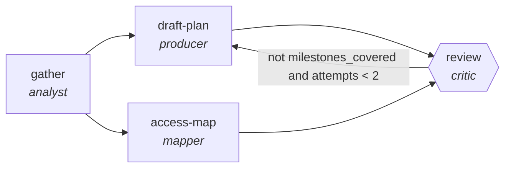

<!-- generated by scripts/gen_cards.py — edit graph.yaml / usecases/catalog.yaml, then `uv run python scripts/gen_cards.py` -->
# 🪪 AGR-093 · `onboarding-plan-builder`

> Build a role-specific 30/60/90 plan from the JD, team context and access requirements, then verify coverage.

| Card ID | Domain | Pattern | Nodes | Edges | Verifiers | Routers | Max steps | Risk surface |
|---|---|---|---|---|---|---|---|---|
| `AGR-093` | hr-people | **planner-executor-verifier** | 4 | 5 | 1 | 0 | 25 | write |

> 🎯 **Requires a goal** — the new hire's role and the team they are joining. Without one the graph refuses and runs no node.

## The graph



Legend: `[/…/]` router · `{{…}}` verifier · `[…]` worker/agent node.

## What it does

Build role-specific onboarding with checkpoint tasks.

## Why it should deliver results

The plan makes intent inspectable before anything touches the world, the executor works inside that plan, and the verifier proves the postcondition actually holds — success is demonstrated, not asserted.

- **Exit contract** — every checkpoint carries a measurable milestone and day-one access is pre-requested
- **Machine-checked** — `all(c.milestone for c in output.plan_30_60_90)`
- **Machine-checked** — `all(a.system and a.requested_on for a in output.access_requests)`
- **Bounded** — hard stop after 25 steps; every loop edge is condition-guarded
- **Golden cases** — `uv run agr eval onboarding-plan-builder` replays recorded cases through the real edge/assert logic (mock runner proves mechanics; `--live` measures your model)
- **Trace gallery** — [every case's route, node outputs, and checked asserts](../../../docs/traces/onboarding-plan-builder.md)

## How to work with it

```bash
uv run agr show onboarding-plan-builder       # full definition
uv run agr profile onboarding-plan-builder    # deterministic structural facts
uv run agr mermaid onboarding-plan-builder    # regenerate the diagram below
uv run agr eval onboarding-plan-builder       # run golden cases (add --live for your endpoint)
uv run agr adapt onboarding-plan-builder --target langgraph > app.py   # compile to runnable LangGraph
uv run agr optimize onboarding-plan-builder   # propose bounded structural improvements (dry-run)
```

Over MCP: `uv run agr mcp` exposes the registry (search / show / profile) to any MCP client.
To evolve it: `uv run agr infuse onboarding-plan-builder <node> <ability>` — every mutation is gate-checked and appended to the graph's lineage log.

## Node roster

| Node | Speciality | Kind | Abilities |
|---|---|---|---|
| `gather` | analyst | agent | analyze |
| `draft-plan` | producer | agent | generate |
| `access-map` | mapper | agent | map_shard |
| `review` | critic | verifier | critique |

## Edge logic

| From | To | Condition |
|---|---|---|
| `gather` | `draft-plan` | always |
| `gather` | `access-map` | always |
| `draft-plan` | `review` | always |
| `access-map` | `review` | always |
| `review` | `draft-plan` | not milestones_covered and attempts < 2 |

## Optional use-cases

Adjacent entries from the use-case catalog this card adapts to with small edits:

- **interview-question-bank** (hr-people, generator-critic) — Generate role questions, critic checks legality and signal. *Verify:* no prohibited-topic questions; rubric attached.
- **engagement-survey-analysis** (hr-people, map-reduce) — Theme open-text responses, reduce with anonymity floor. *Verify:* themes cite response counts; k-anonymity respected.
- **policy-qa-assistant** (hr-people, pipeline) — Answer policy questions with citations to the handbook. *Verify:* every answer cites handbook section.
- **training-gap-analyzer** (hr-people, map-reduce) — Map skills against role matrix, reduce to training plan. *Verify:* gaps reference assessment evidence.
- **schema-migration-planner** (data-analytics, planner-executor-verifier) — Plan backward-compatible schema changes with shadow reads. *Verify:* shadow-read diff empty before cutover.

---
*Regenerate: `uv run python scripts/gen_cards.py` · Index: [CARDS.md](../../../CARDS.md)*
