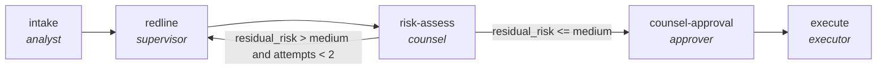

<!-- generated by scripts/gen_cards.py — edit graph.yaml / usecases/catalog.yaml, then `uv run python scripts/gen_cards.py` -->
# 🪪 AGR-120 · `contract-lifecycle`

> Intake a contract, redline it, gate on residual risk, and execute only with counsel approval.

| Card ID | Domain | Pattern | Nodes | Edges | Verifiers | Routers | Max steps | Risk surface |
|---|---|---|---|---|---|---|---|---|
| `AGR-120` | legal-compliance | **human-gate** | 5 | 5 | 0 | 0 | 35 | execute |

> 🎯 **Requires a goal** — the contract to review and the risk posture to hold it to. Without one the graph refuses and runs no node.

## The graph



Legend: `[/…/]` router · `{{…}}` verifier · `[…]` worker/agent node.

## What it does

Intake, redline and execute a contract gated on residual risk and counsel approval.

## Why it should deliver results

A `kind: human` node holds an approval contract that no model may sign — the live runner raises rather than approve its own work. Downstream flow edges stay blocked until the contract evaluates true, which is what makes a graph usable in a regulated domain instead of merely plausible-looking.

- **Exit contract** — a contract executes only at or below medium residual risk with counsel signature
- **Machine-checked** — `output.residual_risk_level in ['low','medium']`
- **Machine-checked** — `output.signed_off == true`
- **Machine-checked** — `output.executed == true`
- **Bounded** — hard stop after 35 steps; every loop edge is condition-guarded
- **Golden cases** — `uv run agr eval contract-lifecycle` replays recorded cases through the real edge/assert logic (mock runner proves mechanics; `--live` measures your model)
- **Trace gallery** — [every case's route, node outputs, and checked asserts](../../../docs/traces/contract-lifecycle.md)

## How to work with it

```bash
uv run agr show contract-lifecycle       # full definition
uv run agr profile contract-lifecycle    # deterministic structural facts
uv run agr mermaid contract-lifecycle    # regenerate the diagram below
uv run agr eval contract-lifecycle       # run golden cases (add --live for your endpoint)
uv run agr adapt contract-lifecycle --target langgraph > app.py   # compile to runnable LangGraph
uv run agr optimize contract-lifecycle   # propose bounded structural improvements (dry-run)
```

Over MCP: `uv run agr mcp` exposes the registry (search / show / profile) to any MCP client.
To evolve it: `uv run agr infuse contract-lifecycle <node> <ability>` — every mutation is gate-checked and appended to the graph's lineage log.

## Node roster

| Node | Speciality | Kind | Abilities |
|---|---|---|---|
| `intake` | analyst | agent | analyze |
| `redline` | supervisor | subgraph | — |
| `risk-assess` | counsel | agent | critique, analyze |
| `counsel-approval` | approver | human | approve |
| `execute` | executor | agent | execute_step |

## Edge logic

| From | To | Condition |
|---|---|---|
| `intake` | `redline` | always |
| `redline` | `risk-assess` | always |
| `risk-assess` | `redline` | residual_risk > medium and attempts < 2 |
| `risk-assess` | `counsel-approval` | residual_risk <= medium |
| `counsel-approval` | `execute` | always |

## Optional use-cases

Adjacent entries from the use-case catalog this card adapts to with small edits:

- **case-law-research** (legal-compliance, pipeline) — Find, shepardize, and brief controlling authority. *Verify:* every citation verified as good law with source.
- **tos-diff-monitor** (legal-compliance, pipeline) — Diff terms-of-service versions, classify materiality. *Verify:* each material change quotes old and new text.
- **ip-portfolio-review** (legal-compliance, map-reduce) — Review marks and patents for renewals and conflicts. *Verify:* deadlines extracted match registry records.

---
*Regenerate: `uv run python scripts/gen_cards.py` · Index: [CARDS.md](../../../CARDS.md)*
