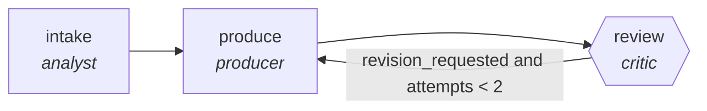

<!-- generated by scripts/gen_cards.py — edit graph.yaml / usecases/catalog.yaml, then `uv run python scripts/gen_cards.py` -->
# 🪪 AGR-056 · `contract-redline-pipeline`

> Compare against playbook, propose redlines with rationale.

| Card ID | Domain | Pattern | Nodes | Edges | Verifiers | Routers | Max steps | Risk surface |
|---|---|---|---|---|---|---|---|---|
| `AGR-056` | legal-compliance | **pipeline** | 3 | 3 | 1 | 0 | 12 | write |

## The graph



Legend: `[/…/]` router · `{{…}}` verifier · `[…]` worker/agent node.

## What it does

Compare against playbook, propose redlines with rationale.

## Why it should deliver results

Staged specialists each own one narrow concern, so quality problems are localized to the stage that produced them instead of being smeared across a single mega-prompt. Output only leaves the graph through the exit contract.

- **Exit contract** — every redline cites a playbook position
- **Machine-checked** — `every redline cites a playbook position`
- **Bounded** — hard stop after 12 steps; every loop edge is condition-guarded
- **Gate-checked** — schema + lint + structural gate run in CI; golden eval cases are the next step for this card (see `evals/` for the format)

## How to work with it

```bash
uv run agr show contract-redline-pipeline       # full definition
uv run agr profile contract-redline-pipeline    # deterministic structural facts
uv run agr mermaid contract-redline-pipeline    # regenerate the diagram below
uv run agr adapt contract-redline-pipeline --target langgraph > app.py   # compile to runnable LangGraph
uv run agr optimize contract-redline-pipeline   # propose bounded structural improvements (dry-run)
```

Over MCP: `uv run agr mcp` exposes the registry (search / show / profile) to any MCP client.
To evolve it: `uv run agr infuse contract-redline-pipeline <node> <ability>` — every mutation is gate-checked and appended to the graph's lineage log.

## Node roster

| Node | Speciality | Kind | Abilities |
|---|---|---|---|
| `intake` | analyst | agent | analyze |
| `produce` | producer | agent | generate |
| `review` | critic | verifier | critique |

## Edge logic

| From | To | Condition |
|---|---|---|
| `intake` | `produce` | always |
| `produce` | `review` | always |
| `review` | `produce` | revision_requested and attempts < 2 |

## Optional use-cases

Adjacent entries from the use-case catalog this card adapts to with small edits:

- **gdpr-data-audit** (legal-compliance, parallel-swarm) — Workers map personal data flows per system. *Verify:* every flow lists lawful basis or a gap.
- **case-law-research** (legal-compliance, pipeline) — Find, shepardize, and brief controlling authority. *Verify:* every citation verified as good law with source.
- **tos-diff-monitor** (legal-compliance, pipeline) — Diff terms-of-service versions, classify materiality. *Verify:* each material change quotes old and new text.
- **ip-portfolio-review** (legal-compliance, map-reduce) — Review marks and patents for renewals and conflicts. *Verify:* deadlines extracted match registry records.
- **cloud-cost-optimizer** (devops-sre, pipeline) — Scan usage, propose rightsizing, verify against SLO headroom. *Verify:* projected savings computed from real billing export.

---
*Regenerate: `uv run python scripts/gen_cards.py` · Index: [CARDS.md](../../../CARDS.md)*
