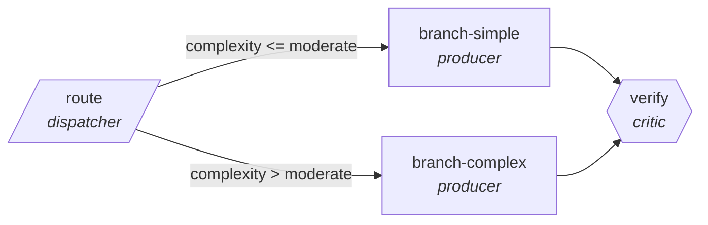

<!-- generated by scripts/gen_cards.py — edit graph.yaml / usecases/catalog.yaml, then `uv run python scripts/gen_cards.py` -->
# 🪪 AGR-059 · `ediscovery-triage`

> Route documents by privilege, relevance, and confidentiality.

| Card ID | Domain | Pattern | Nodes | Edges | Verifiers | Routers | Max steps | Risk surface |
|---|---|---|---|---|---|---|---|---|
| `AGR-059` | legal-compliance | **router** | 4 | 4 | 1 | 1 | 12 | write |

## The graph



Legend: `[/…/]` router · `{{…}}` verifier · `[…]` worker/agent node.

## What it does

Route documents by privilege, relevance, and confidentiality.

## Why it should deliver results

A cheap classifier sends every item down the narrowest branch that can handle it, so cost and latency scale with the difficulty of each item rather than the worst case. Escalation edges guarantee hard items still reach the strong path.

- **Exit contract** — recall on seeded relevant set above threshold
- **Machine-checked** — `recall on seeded relevant set above threshold`
- **Bounded** — hard stop after 12 steps; the topology is acyclic
- **Gate-checked** — schema + lint + structural gate run in CI; golden eval cases are the next step for this card (see `evals/` for the format)

## How to work with it

```bash
uv run agr show ediscovery-triage       # full definition
uv run agr profile ediscovery-triage    # deterministic structural facts
uv run agr mermaid ediscovery-triage    # regenerate the diagram below
uv run agr adapt ediscovery-triage --target langgraph > app.py   # compile to runnable LangGraph
uv run agr optimize ediscovery-triage   # propose bounded structural improvements (dry-run)
```

Over MCP: `uv run agr mcp` exposes the registry (search / show / profile) to any MCP client.
To evolve it: `uv run agr infuse ediscovery-triage <node> <ability>` — every mutation is gate-checked and appended to the graph's lineage log.

## Node roster

| Node | Speciality | Kind | Abilities |
|---|---|---|---|
| `route` | dispatcher | router | dispatch |
| `branch-simple` | producer | agent | generate |
| `branch-complex` | producer | agent | generate |
| `verify` | critic | verifier | critique |

## Edge logic

| From | To | Condition |
|---|---|---|
| `route` | `branch-simple` | complexity <= moderate |
| `route` | `branch-complex` | complexity > moderate |
| `branch-simple` | `verify` | always |
| `branch-complex` | `verify` | always |

## Optional use-cases

Adjacent entries from the use-case catalog this card adapts to with small edits:

- **gdpr-data-audit** (legal-compliance, parallel-swarm) — Workers map personal data flows per system. *Verify:* every flow lists lawful basis or a gap.
- **case-law-research** (legal-compliance, pipeline) — Find, shepardize, and brief controlling authority. *Verify:* every citation verified as good law with source.
- **tos-diff-monitor** (legal-compliance, pipeline) — Diff terms-of-service versions, classify materiality. *Verify:* each material change quotes old and new text.
- **ip-portfolio-review** (legal-compliance, map-reduce) — Review marks and patents for renewals and conflicts. *Verify:* deadlines extracted match registry records.
- **invoice-reconciliation** (business-ops, router) — Match invoices to POs, route exceptions by mismatch type. *Verify:* matched set balances; exceptions carry mismatch reason.

---
*Regenerate: `uv run python scripts/gen_cards.py` · Index: [CARDS.md](../../../CARDS.md)*
