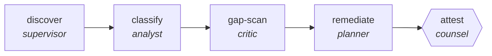

<!-- generated by scripts/gen_cards.py — edit graph.yaml / usecases/catalog.yaml, then `uv run python scripts/gen_cards.py` -->
# 🪪 AGR-058 · `gdpr-data-audit`

> Map personal data across systems, classify lawful basis, find gaps, and produce a remediation plan.

| Card ID | Domain | Pattern | Nodes | Edges | Verifiers | Routers | Max steps | Risk surface |
|---|---|---|---|---|---|---|---|---|
| `AGR-058` | legal-compliance | **parallel-swarm** | 5 | 4 | 1 | 0 | 30 | read |

## The graph



Legend: `[/…/]` router · `{{…}}` verifier · `[…]` worker/agent node.

## What it does

Workers map personal data flows per system.

## Why it should deliver results

Independent workers cover disjoint slices of the input at the same time. Because they cannot see each other's drafts, agreement is evidence and disagreement surfaces blind spots; the aggregator merges with explicit rules. Wall-clock time is roughly the slowest worker, not the sum.

- **Exit contract** — every store carries a lawful basis; every gap carries an owner and a due date
- **Machine-checked** — `output.unclassified_stores == 0`
- **Machine-checked** — `all(gp.owner and gp.due for gp in output.gaps)`
- **Bounded** — hard stop after 30 steps; the topology is acyclic
- **Golden cases** — `uv run agr eval gdpr-data-audit` replays recorded cases through the real edge/assert logic (mock runner proves mechanics; `--live` measures your model)
- **Trace gallery** — [every case's route, node outputs, and checked asserts](../../../docs/traces/gdpr-data-audit.md)

## How to work with it

```bash
uv run agr show gdpr-data-audit       # full definition
uv run agr profile gdpr-data-audit    # deterministic structural facts
uv run agr mermaid gdpr-data-audit    # regenerate the diagram below
uv run agr eval gdpr-data-audit       # run golden cases (add --live for your endpoint)
uv run agr adapt gdpr-data-audit --target langgraph > app.py   # compile to runnable LangGraph
uv run agr optimize gdpr-data-audit   # propose bounded structural improvements (dry-run)
```

Over MCP: `uv run agr mcp` exposes the registry (search / show / profile) to any MCP client.
To evolve it: `uv run agr infuse gdpr-data-audit <node> <ability>` — every mutation is gate-checked and appended to the graph's lineage log.

## Node roster

| Node | Speciality | Kind | Abilities |
|---|---|---|---|
| `discover` | supervisor | subgraph | — |
| `classify` | analyst | agent | analyze |
| `gap-scan` | critic | agent | critique |
| `remediate` | planner | agent | decompose_goal |
| `attest` | counsel | verifier | critique |

## Edge logic

| From | To | Condition |
|---|---|---|
| `discover` | `classify` | always |
| `classify` | `gap-scan` | always |
| `gap-scan` | `remediate` | always |
| `remediate` | `attest` | always |

## Optional use-cases

Adjacent entries from the use-case catalog this card adapts to with small edits:

- **case-law-research** (legal-compliance, pipeline) — Find, shepardize, and brief controlling authority. *Verify:* every citation verified as good law with source.
- **tos-diff-monitor** (legal-compliance, pipeline) — Diff terms-of-service versions, classify materiality. *Verify:* each material change quotes old and new text.
- **ip-portfolio-review** (legal-compliance, map-reduce) — Review marks and patents for renewals and conflicts. *Verify:* deadlines extracted match registry records.
- **brand-consistency-audit** (content-marketing, parallel-swarm) — Workers audit assets against voice and visual guidelines. *Verify:* violations reported per asset with rule ids.
- **regulatory-filing-check** (finance, parallel-swarm) — Workers check filing sections against requirement checklists. *Verify:* every checklist item pass or fail with location.

---
*Regenerate: `uv run python scripts/gen_cards.py` · Index: [CARDS.md](../../../CARDS.md)*
