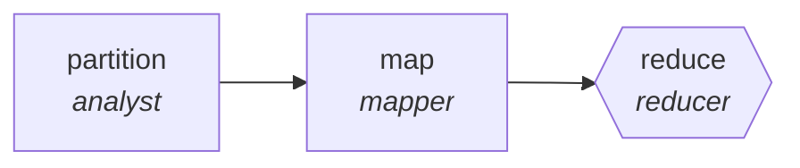

<!-- generated by scripts/gen_cards.py — edit graph.yaml / usecases/catalog.yaml, then `uv run python scripts/gen_cards.py` -->
# 🪪 AGR-057 · `license-compliance-scan`

> Scan dependency licenses, reduce to obligations report.

| Card ID | Domain | Pattern | Nodes | Edges | Verifiers | Routers | Max steps | Risk surface |
|---|---|---|---|---|---|---|---|---|
| `AGR-057` | legal-compliance | **map-reduce** | 3 | 2 | 1 | 0 | 20 | write |

## The graph



Legend: `[/…/]` router · `{{…}}` verifier · `[…]` worker/agent node.

## What it does

Scan dependency licenses, reduce to obligations report.

## Why it should deliver results

Work fans out over shards and the reduce step merges with explicit dedupe and conflict rules, so throughput scales with shard count while the output stays a single consistent artifact.

- **Exit contract** — SPDX ids resolved; copyleft conflicts flagged
- **Machine-checked** — `all(p.spdx for p in output.packages) and not output.copyleft_conflicts`
- **Bounded** — hard stop after 20 steps; the topology is acyclic
- **Golden cases** — `uv run agr eval license-compliance-scan` replays recorded cases through the real edge/assert logic (mock runner proves mechanics; `--live` measures your model)
- **Trace gallery** — [every case's route, node outputs, and checked asserts](../../../docs/traces/license-compliance-scan.md)

## How to work with it

```bash
uv run agr show license-compliance-scan       # full definition
uv run agr profile license-compliance-scan    # deterministic structural facts
uv run agr mermaid license-compliance-scan    # regenerate the diagram below
uv run agr eval license-compliance-scan       # run golden cases (add --live for your endpoint)
uv run agr adapt license-compliance-scan --target langgraph > app.py   # compile to runnable LangGraph
uv run agr optimize license-compliance-scan   # propose bounded structural improvements (dry-run)
```

Over MCP: `uv run agr mcp` exposes the registry (search / show / profile) to any MCP client.
To evolve it: `uv run agr infuse license-compliance-scan <node> <ability>` — every mutation is gate-checked and appended to the graph's lineage log.

## Node roster

| Node | Speciality | Kind | Abilities |
|---|---|---|---|
| `partition` | analyst | agent | analyze |
| `map` | mapper | agent | map_shard |
| `reduce` | reducer | verifier | reduce_merge |

## Edge logic

| From | To | Condition |
|---|---|---|
| `partition` | `map` | always |
| `map` | `reduce` | always |

## Optional use-cases

Adjacent entries from the use-case catalog this card adapts to with small edits:

- **gdpr-data-audit** (legal-compliance, parallel-swarm) — Workers map personal data flows per system. *Verify:* every flow lists lawful basis or a gap.
- **case-law-research** (legal-compliance, pipeline) — Find, shepardize, and brief controlling authority. *Verify:* every citation verified as good law with source.
- **tos-diff-monitor** (legal-compliance, pipeline) — Diff terms-of-service versions, classify materiality. *Verify:* each material change quotes old and new text.
- **ip-portfolio-review** (legal-compliance, map-reduce) — Review marks and patents for renewals and conflicts. *Verify:* deadlines extracted match registry records.
- **data-catalog-enrichment** (data-analytics, map-reduce) — Describe every table and column, reduce into a searchable catalog. *Verify:* descriptions exist for all tables; lineage links resolve.

---
*Regenerate: `uv run python scripts/gen_cards.py` · Index: [CARDS.md](../../../CARDS.md)*
