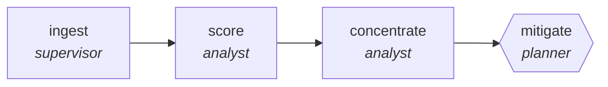

<!-- generated by scripts/gen_cards.py — edit graph.yaml / usecases/catalog.yaml, then `uv run python scripts/gen_cards.py` -->
# 🪪 AGR-100 · `supplier-risk-monitor`

> Score supplier concentration, financial and geographic risk, then plan mitigation for anything above appetite.

| Card ID | Domain | Pattern | Nodes | Edges | Verifiers | Routers | Max steps | Risk surface |
|---|---|---|---|---|---|---|---|---|
| `AGR-100` | logistics-retail | **map-reduce** | 4 | 3 | 1 | 0 | 25 | read |

## The graph



Legend: `[/…/]` router · `{{…}}` verifier · `[…]` worker/agent node.

## What it does

Scan supplier news and filings, reduce to risk deltas.

## Why it should deliver results

Work fans out over shards and the reduce step merges with explicit dedupe and conflict rules, so throughput scales with shard count while the output stays a single consistent artifact.

- **Exit contract** — every supplier above risk appetite carries a named mitigation owner
- **Machine-checked** — `output.above_appetite == output.mitigations_planned`
- **Machine-checked** — `output.single_source_flagged == true`
- **Bounded** — hard stop after 25 steps; the topology is acyclic
- **Golden cases** — `uv run agr eval supplier-risk-monitor` replays recorded cases through the real edge/assert logic (mock runner proves mechanics; `--live` measures your model)
- **Trace gallery** — [every case's route, node outputs, and checked asserts](../../../docs/traces/supplier-risk-monitor.md)

## How to work with it

```bash
uv run agr show supplier-risk-monitor       # full definition
uv run agr profile supplier-risk-monitor    # deterministic structural facts
uv run agr mermaid supplier-risk-monitor    # regenerate the diagram below
uv run agr eval supplier-risk-monitor       # run golden cases (add --live for your endpoint)
uv run agr adapt supplier-risk-monitor --target langgraph > app.py   # compile to runnable LangGraph
uv run agr optimize supplier-risk-monitor   # propose bounded structural improvements (dry-run)
```

Over MCP: `uv run agr mcp` exposes the registry (search / show / profile) to any MCP client.
To evolve it: `uv run agr infuse supplier-risk-monitor <node> <ability>` — every mutation is gate-checked and appended to the graph's lineage log.

## Node roster

| Node | Speciality | Kind | Abilities |
|---|---|---|---|
| `ingest` | supervisor | subgraph | — |
| `score` | analyst | agent | analyze |
| `concentrate` | analyst | agent | analyze |
| `mitigate` | planner | verifier | decompose_goal |

## Edge logic

| From | To | Condition |
|---|---|---|
| `ingest` | `score` | always |
| `score` | `concentrate` | always |
| `concentrate` | `mitigate` | always |

## Optional use-cases

Adjacent entries from the use-case catalog this card adapts to with small edits:

- **route-optimization-review** (logistics-retail, generator-critic) — Propose delivery routes, critic checks constraints. *Verify:* routes satisfy time windows and capacity.
- **inventory-forecast-critic** (logistics-retail, generator-critic) — Forecast SKU demand, critic backtests against history. *Verify:* backtest error below naive baseline.
- **demand-signal-digest** (logistics-retail, map-reduce) — Merge sales, weather, and events into demand notes. *Verify:* signals quantified with source data ranges.
- **planogram-compliance-review** (logistics-retail, parallel-swarm) — Workers check shelf photos against planograms. *Verify:* violations localized per fixture with confidence.
- **data-catalog-enrichment** (data-analytics, map-reduce) — Describe every table and column, reduce into a searchable catalog. *Verify:* descriptions exist for all tables; lineage links resolve.

---
*Regenerate: `uv run python scripts/gen_cards.py` · Index: [CARDS.md](../../../CARDS.md)*
