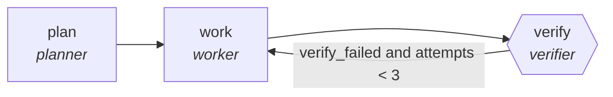

<!-- generated by scripts/gen_cards.py — edit graph.yaml / usecases/catalog.yaml, then `uv run python scripts/gen_cards.py` -->
# 🪪 AGR-033 · `citation-integrity-audit`

> Workers verify each citation exists and supports its claim.

| Card ID | Domain | Pattern | Nodes | Edges | Verifiers | Routers | Max steps | Risk surface |
|---|---|---|---|---|---|---|---|---|
| `AGR-033` | research-knowledge | **parallel-swarm** | 3 | 3 | 1 | 0 | 30 | execute |

> 🎯 **Requires a goal** — the document whose citations to verify and the sources it cites. Without one the graph refuses and runs no node.

## The graph



Legend: `[/…/]` router · `{{…}}` verifier · `[…]` worker/agent node.

## What it does

Workers verify each citation exists and supports its claim.

## Why it should deliver results

Independent workers cover disjoint slices of the input at the same time. Because they cannot see each other's drafts, agreement is evidence and disagreement surfaces blind spots; the aggregator merges with explicit rules. Wall-clock time is roughly the slowest worker, not the sum.

- **Exit contract** — every citation resolves; mismatches listed
- **Machine-checked** — `all(c.resolves for c in output.citations)`
- **Bounded** — hard stop after 30 steps; every loop edge is condition-guarded
- **Golden cases** — `uv run agr eval citation-integrity-audit` replays recorded cases through the real edge/assert logic (mock runner proves mechanics; `--live` measures your model)
- **Trace gallery** — [every case's route, node outputs, and checked asserts](../../../docs/traces/citation-integrity-audit.md)

## How to work with it

```bash
uv run agr show citation-integrity-audit       # full definition
uv run agr profile citation-integrity-audit    # deterministic structural facts
uv run agr mermaid citation-integrity-audit    # regenerate the diagram below
uv run agr eval citation-integrity-audit       # run golden cases (add --live for your endpoint)
uv run agr adapt citation-integrity-audit --target langgraph > app.py   # compile to runnable LangGraph
uv run agr optimize citation-integrity-audit   # propose bounded structural improvements (dry-run)
```

Over MCP: `uv run agr mcp` exposes the registry (search / show / profile) to any MCP client.
To evolve it: `uv run agr infuse citation-integrity-audit <node> <ability>` — every mutation is gate-checked and appended to the graph's lineage log.

## Node roster

| Node | Speciality | Kind | Abilities |
|---|---|---|---|
| `plan` | planner | agent | decompose_goal |
| `work` | worker | agent | run_command, edit_files |
| `verify` | verifier | verifier | run_command |

## Edge logic

| From | To | Condition |
|---|---|---|
| `plan` | `work` | always |
| `work` | `verify` | always |
| `verify` | `work` | verify_failed and attempts < 3 |

## Optional use-cases

Adjacent entries from the use-case catalog this card adapts to with small edits:

- **systematic-meta-analysis** (research-knowledge, pipeline) — PRISMA-style screen, extract, pool effect sizes. *Verify:* inclusion log complete; effect sizes recomputable.
- **patent-landscape** (research-knowledge, map-reduce) — Cluster patents by claim family, summarize white space. *Verify:* cluster assignments reproducible; ids valid.
- **survey-design-critic** (research-knowledge, generator-critic) — Draft survey, critic hunts leading and double-barreled items. *Verify:* zero flagged items remain; branching logic validated.
- **grant-proposal-pipeline** (research-knowledge, pipeline) — Aims, methods, budget drafted then compliance-checked. *Verify:* funder checklist items all satisfied.
- **brand-consistency-audit** (content-marketing, parallel-swarm) — Workers audit assets against voice and visual guidelines. *Verify:* violations reported per asset with rule ids.

---
*Regenerate: `uv run python scripts/gen_cards.py` · Index: [CARDS.md](../../../CARDS.md)*
